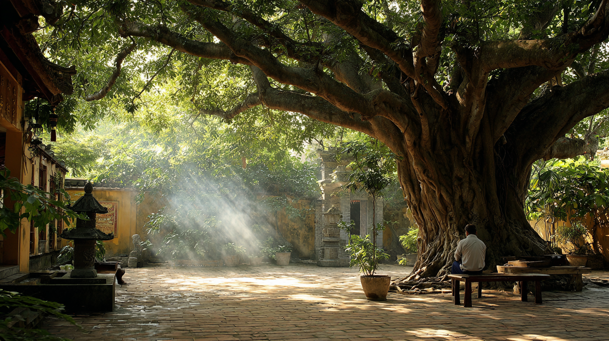

Miền Nam đang vào những ngày nóng rát.
Ta có hẹn với một người bạn, nhưng lại đến sớm hơn dự tính.
Đứng trước cổng chùa lớn bên đường, chẳng hiểu sao chân tự đưa ta bước vào, như người lỡ quên một điều gì đó và vô tình tìm lại.

Lâu lắm rồi, ta không còn nhớ lần cuối cùng ghé lại chốn thiền môn là khi nào.

Vừa bước qua cổng chùa, không khí như đổi khác.
Chỉ còn tiếng gió nhè nhẹ quấn vào mùi trầm thoảng.
Tiếng chuông vang lên – từng nhịp đều đặn như bước chân của thời gian.

Trong chánh điện, các Thầy đang tụng kinh.
Âm vang xa xăm, không rõ từng chữ, nhưng ta nhận ra nhịp quen thuộc của Bát Nhã Tâm Kinh:

> Xá Lợi Tử, sắc chẳng khác không, không chẳng khác sắc, sắc tức là không, không tức là sắc…

Ta ngồi xuống chiếc ghế dưới gốc bồ đề cổ thụ.
Tán lá già che bóng, tiếng lá xào xạc như trò chuyện cùng nắng.

Một lát sau, một vị sư thầy đi ngang qua. Thầy có dáng người thanh thoát.

Ta hỏi về ý nghĩa bài kinh.
Thầy dừng lại, ngồi xuống bên cạnh, và bắt đầu giải thích.
Thầy nói về duyên khởi, về Tánh Không, về sự không tự tính của vạn pháp.
Giọng thầy ấm và liền mạch, như nước suối chảy qua những hòn sỏi đã nằm yên từ rất lâu.

Thầy tinh thông thật.
Lời thầy trôi chảy, đầy ví dụ, đầy kinh điển, đầy những đoạn chuyện cổ mà chỉ người sống nhiều năm với kinh sách mới có được.

Ta mỉm cười, gật nhẹ – không phải để chứng tỏ hiểu mà bởi tôn kính sự am tường của thầy.

Rồi đột nhiên, giữa những lời giảng của thầy, trong ta bỗng vọng lên bài kệ của anh chàng cư sĩ họ Lư – những lời như lưỡi dao cắt thẳng vào gốc rễ:

> Bồ đề vốn chẳng cây, 
> Gương sáng cũng chẳng đài, 
> Xưa nay không một vật, 
> Nơi nào dính bụi trần?

Ta khẽ thở ra.
Lời Thầy và bài kệ ấy – một bên vững vàng như giàn kinh sách, một bên sắc lịm như ánh chớp – thật khác nhau một trời một vực.

Còn với ta,
> Sắc đơn giản...chỉ là Sắc. 
> Không đơn giản...chỉ là Không. 
> Không cầu giải thích. 
> Không cần tìm nghĩa. 

Và ngay nơi gốc bồ đề ấy,
giữa tiếng kinh đang ngân,
giữa hơi nóng miền Nam vẫn lặn vào đất,
ta chợt thấy rõ một điều rất đơn giản:

> Ta thấy chính mình.

Chẳng phải đơn giản hơn đống kinh sách mà vị Thầy kia đã nhồi nhét vào đầu hay sao?
Chẳng phải ngay nơi đó Tánh Không tự hiển lộ hay sao?
Đối với ta Đạo thật là...giản dị.
