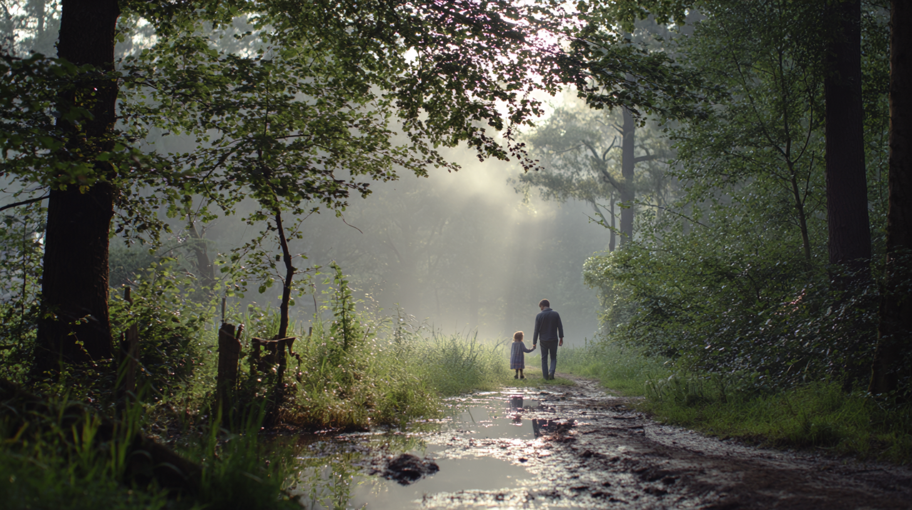

Sau một đêm mưa dài, sáng nay trời trong và nắng dịu. Con đường đất ven rừng còn thơm mùi lá ướt. Hai cha con đi bộ chậm rãi, không vội, như thể chỉ cần đi là đủ.

Cô bé im lặng một lúc rồi hỏi, giọng tò mò:

> Cha hay nói về “sự thấy và biết”. Con thấy cũng bình thường mà. Ai chả thấy, chả biết. Có gì đặc biệt đâu cha? Các sách thiền
> cũng nói về nó đấy thôi.

Người cha không đáp ngay. Ông nhìn con một lúc, như nhìn xuyên qua lớp câu chữ để thấy cái đang hỏi thật sự. Rồi ông cúi xuống nhặt một cành cây cũ, mỏng, khô. Ông đưa cành cây quơ qua lại trước mặt con, không nhanh, không chậm.

Cô bé ban đầu không phản ứng. Rồi chân mày khẽ nhíu lại. Mắt con mở to hơn, như vừa chạm phải một điều gì lạ.

Ông đặt cành cây xuống, hỏi đơn giản:

> Nói cho cha biết, con đã thấy gì?

Cô bé im lặng. Sự im lặng này không phải bí ý, mà là đang dò tìm. Một lúc sau con nói:

> Con thấy… hai thứ. Thứ nhất… con cũng không biết nó là gì. Chỉ là… có “cái gì đó” đang thấy. Thứ hai là tiếng nói trong đầu. Nó chạy loạn xạ, nó hỏi: “cái gì vậy?”, “cha làm gì vậy?”, “mình phải trả lời sao?”, “mình có đúng không?”

Người cha mỉm cười:

> Đúng rồi. Hai thứ đó luôn đi cùng nhau trong đời con, nhưng con thường chỉ biết một.

Ông đưa tay ra khoảng không trước mặt, như thể khoảng không ấy là một vật thật đang hiện diện:

> Cái thứ nhất… nó không phán xét. Nó giống như cái khoảng không đang chứa lấy cha con mình lúc này vậy. Con thấy không? Gió thổi qua thì khoảng không ấy lạnh, nắng rọi xuống thì nó nóng, nhưng bản thân khoảng không thì không bị trầy xước, cũng chẳng đòi trở thành nắng hay gió.

Ông nhìn thẳng vào con, giọng bình thản:

> Còn tâm trí con là một gã thư ký bận rộn, suốt ngày chạy tới chạy lui để dán nhãn lên mọi thứ: “nóng quá”, “khó chịu quá”, “phải đi chỗ khác thôi”. Con thường nhầm mình là gã thư ký đó, nên con mới mệt lử.

Cô bé bật cười khẽ, rồi lại chùng xuống:

> Nhưng… thư ký đó giúp con sống mà cha. Không có nó sao con học, con làm bài, con biết đúng sai?

Cha gật đầu:

> Nó hữu ích. Nhưng hữu ích không có nghĩa là làm chủ. Gã thư ký sinh ra để ghi chép, không phải để kéo con đi bằng dây.

Cô bé ngẫm một chút:

> Vậy cái mà cha gọi là “thấy biết” chính là… cái khoảng không đó?

Cha không vội gật hay lắc. Ông chỉ nói, như đặt một thứ thật vào tay con:

> Sách vở nói về nó nghe hay lắm, nhưng nó giống như việc cha mô tả cho con vị của một quả chanh rừng vậy. Cha có thể nói nó chua, nó gắt, nó làm rân rân đầu lưỡi… Con có thể học thuộc lòng tất cả những từ đó, nhưng nếu con chưa một lần cắn vào, thì cái “biết” của con chỉ là một mớ giấy vụn.

Ông dừng lại, để câu nói rơi xuống như giọt nước vào lòng im:

> Cái “thấy biết” cha nói, chính là cái rùng mình ngay lúc miếng chanh chạm vào lưỡi con – khi đó, con không cần một từ ngữ nào cả.

Cô bé cúi nhìn con đường ướt, như đang lắng nghe cái “rùng mình” ấy trong chính mình:

> Con hiểu… nhưng con hay bị chữ nghĩa kéo đi.

Cha cười nhẹ:

> Vì gã thư ký thích giấy tờ. Nó sợ khoảng không—vì khoảng không không cho nó bám.

Hai cha con đi tiếp. Qua một khúc quanh, có một thân cây mục nằm ngang đường. Cô bé bước qua, trượt chân nhẹ. Một cơn nhói chạy dọc bắp chân. Con khựng lại, mặt nhăn.

> Đau quá…

Cha đứng lại. Không vội dỗ. Ông hỏi đúng vào chỗ đang bốc:

> Ngay bây giờ, con thấy gì?

Cô bé nén hơi:

> Con thấy đau. Và trong đầu con bắt đầu nói: “mình vụng quá”, “mình vô dụng”, “lúc nào cũng làm hỏng”.

Người cha gật, như thể con vừa phân biệt được hai lớp vốn hay dính chặt. Ông nói chậm rãi:

> Đau là thật, giống như một cơn gió lốc tạt qua mặt con vậy. Nó làm con rát, làm con run. Nhưng câu chuyện “con vô dụng” chỉ là những hạt bụi mà cơn gió đó cuốn theo thôi.

Ông nhìn con, giọng vẫn dịu:

> Nếu con nhắm nghiền mắt và sợ hãi, bụi sẽ lọt vào làm con đau thêm. Nhưng nếu con cứ đứng yên, để gió thổi qua, thì gió sẽ đi mất và bụi sẽ lắng xuống. Cảm giác đau có thể chưa hết ngay, nhưng cái ý nghĩ “con tệ hại” sẽ không còn bám vào con được nữa.

Ông nhắc khẽ, như nhắc điều hiển nhiên:

> Con chỉ là người đứng trong gió, chứ không phải là cơn gió đó.

Cô bé thở ra. Cơn đau vẫn còn, nhưng ngực con bớt thắt. Tiếng nói trong đầu vẫn le lói, nhưng không còn ầm ĩ như lúc đầu.

Con hỏi nhỏ:

> Nhưng con hay bị kéo theo, cha…

Người cha gật đầu:

> Ừ. Vì con tưởng mình phải làm gì đó.

Ông nhìn con, rồi nói ngắn:

> Con chỉ cần quan sát thôi.

Cô bé khẽ nhíu mày:

> Chỉ vậy thôi sao?

> Chỉ vậy thôi. Mọi thứ đến thì sẽ đi. Cơn đau đến rồi cũng đổi dạng. Ý nghĩ đến rồi cũng tan. Con không cần nỗ lực đẩy nó đi, cũng không cần nỗ lực giữ nó lại.

Ông đưa tay ra khoảng không, như đưa con trở về chỗ rộng nhất:

> Chỉ thấy rõ: nó đến, nó ở, rồi nó đi. Khi con không can thiệp, tự nó rời.

Hai cha con bước tiếp. Gió vẫn thổi. Nắng vẫn rọi. Gã thư ký trong đầu thỉnh thoảng vẫn chạy tới chạy lui. Nhưng cô bé bắt đầu nhận ra: có một khoảng không lặng lẽ đang chứa tất cả — và không đòi thêm điều gì.
