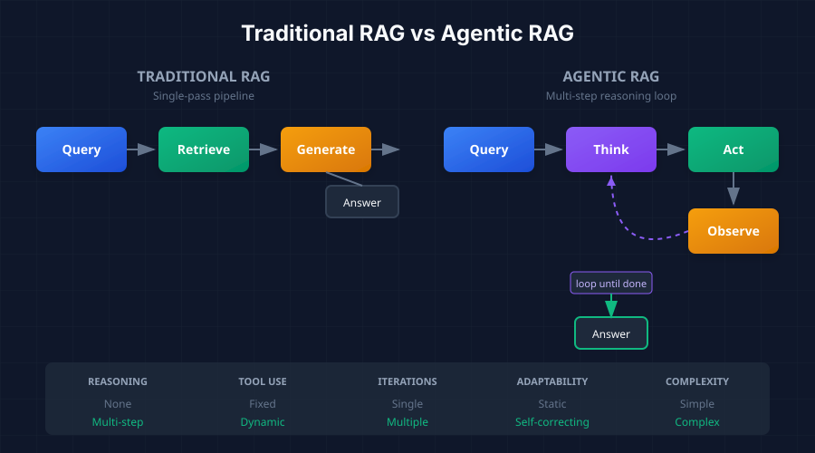

*A comprehensive guide to understanding and implementing autonomous AI agents*

Welcome to this multi-part series on building agentic AI systems in Rust. If you've been working with traditional RAG (Retrieval-Augmented Generation) pipelines and wondered how to give your AI more autonomy—the ability to reason, plan, and take actions—this series is for you.

We'll explore a production-ready architecture called **Profile + Stepper + Executor** that cleanly separates concerns and enables building everything from simple extractors to complex multi-tool agents.

## What is an Agentic Agent?

An **agentic agent** is an autonomous system that can reason, plan, and take actions to accomplish goals. Unlike traditional request-response systems, agentic agents exhibit four key behaviors:

- **Reason** about problems before acting
- **Decide** which tools to use and when
- **Iterate** through multiple steps until the goal is achieved
- **Adapt** based on intermediate results

Think of the difference between a calculator and a research assistant. A calculator takes input and produces output in a single pass. A research assistant might search multiple sources, evaluate what they find, refine their search, and synthesize information across iterations before delivering an answer.

## Traditional RAG vs Agentic RAG

The fundamental distinction lies in how these systems process queries.

**Traditional RAG** follows a linear, single-pass flow:

```
Query → Retrieve → Generate → Answer
```

The system receives a query, retrieves relevant documents, generates a response based on those documents, and returns an answer. It's predictable and efficient, but limited.

**Agentic RAG** introduces a reasoning loop:

```
Query → Think → Act → Observe → [loop until done] → Answer
```

The agent receives a query, reasons about what it needs to do, takes an action (which might be using a tool, searching, or generating), observes the result, and then decides whether to continue reasoning or deliver a final answer.



## Key Characteristics

| Aspect | Traditional RAG | Agentic RAG |
|--------|-----------------|-------------|
| **Reasoning** | None | Multi-step |
| **Tool Use** | Fixed pipeline | Dynamic selection |
| **Iterations** | Single pass | Multiple loops |
| **Adaptability** | Static | Self-correcting |
| **Complexity** | Simple queries | Complex tasks |

## When to Use Each Approach

Understanding when to use agentic systems versus traditional RAG is crucial for building efficient applications.

### Use Agentic Agents When:

- **Tasks require multi-step reasoning**: "Find all products mentioned in our last quarter's reviews and compare their sentiment scores"
- **Multiple tools may be needed**: The agent might need to search, calculate, and format data
- **The path to solution isn't predetermined**: Open-ended research questions
- **Self-correction is valuable**: When initial results might be incomplete or incorrect

### Use Traditional RAG When:

- **Simple question-answering**: "What is our return policy?"
- **Single retrieval is sufficient**: Direct lookups with clear answers
- **Latency is critical**: Real-time applications where speed matters
- **Predictable behavior is required**: Compliance or audit scenarios

## What's Coming Next

In this series, we'll cover:

- **Part 2: Core Architecture** - The Profile + Stepper + Executor design pattern and why it matters
- **Part 3: Context Management** - Understanding AgentContext vs ExecutionContext
- **Part 4: The Stepper Pattern** - Implementing different reasoning strategies (ReAct, Function Calling)
- **Part 5: Middleware Pipeline** - Adding cross-cutting concerns without modifying core logic
- **Part 6: Building Tools** - Creating type-safe, composable tools for your agents
- **Part 7: Putting It All Together** - Complete implementation examples

Each part will include working Rust code, architectural diagrams, and practical examples you can adapt for your own systems.

---

**Next up**: Part 2 - Core Architecture: Profile + Stepper + Executor

*This series is based on the Reflexify agentic architecture, designed for production multi-tenant SaaS applications.*
