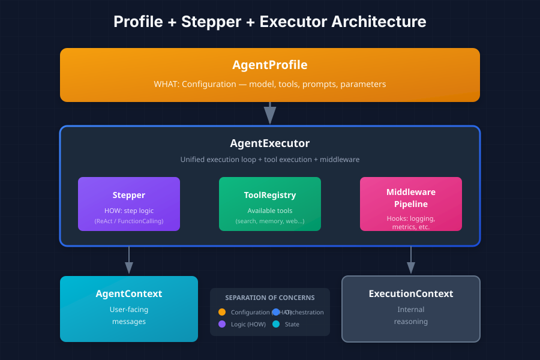
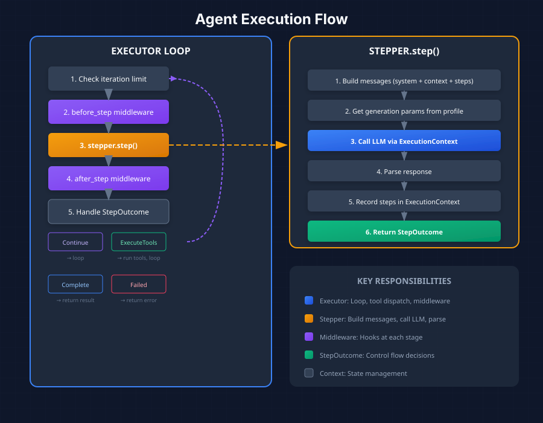

*The Profile + Stepper + Executor pattern for clean, extensible agent design*

---

In [Part 1](/posts/building-agentic-agent-part-1-introduction), we explored what makes agentic agents different from traditional RAG systems. Now let's dive into the architecture that makes them possible.

## The Profile + Stepper + Executor Pattern

Our agent system follows a clean separation of concerns through three primary components:

- **Profile** (WHAT): Configuration that defines the agent's behavior
- **Stepper** (HOW): Logic for executing individual reasoning steps
- **Executor** (ORCHESTRATION): The loop that coordinates everything



This separation isn't arbitrary—it enables powerful capabilities:

| Component | Responsibility | Why Separate? |
|-----------|---------------|---------------|
| **Profile** | Configuration | Change behavior without code changes |
| **Stepper** | Step execution logic | Swap reasoning patterns (ReAct, FunctionCalling) |
| **Executor** | Loop + tools + middleware | Single execution path for all agent types |
| **Context** | Conversation state | Different persistence strategies |

## AgentProfile: Defining What an Agent Does

`AgentProfile` is the declarative configuration that defines everything about an agent's behavior. It's immutable after creation and safe for `Arc` sharing across threads.

```rust
pub struct AgentProfile {
    /// Unique identifier for this profile
    pub id: ProfileId,

    /// Human-readable name
    pub name: String,

    /// Description for documentation
    pub description: String,

    /// Which LLM to use - resolved via LlmRouter at runtime
    pub model: ModelRef,

    /// The execution strategy (React, FunctionCalling)
    pub stepper_type: StepperType,

    /// System prompt template
    pub system_prompt: String,

    /// Tool definitions available for this agent
    pub tools: Vec<ToolDefinition>,

    /// Maximum iterations before giving up
    pub max_iterations: usize,

    /// LLM generation parameters
    pub generation: GenerationConfig,

    /// Middleware stack for this profile
    pub middleware: Vec<MiddlewareId>,

    /// Response format for structured output
    pub response_format: Option<StructuredOutputFormat>,

    /// Additional metadata
    pub metadata: HashMap<String, serde_json::Value>,
}
```

The profile includes a helper method that builds generation parameters, including structured output schemas when needed:

```rust
impl AgentProfile {
    pub fn generation_params(&self) -> GenerationParams {
        let mut params = GenerationParams::new()
            .temperature(self.generation.temperature)
            .max_tokens(self.generation.max_tokens);

        if let Some(ref format) = self.response_format {
            params = params.json_schema(&format.name, format.schema.clone());
        }

        params
    }
}
```

## Supporting Types

The profile relies on several supporting types:

```rust
/// Type of stepper to use for agent execution
pub enum StepperType {
    /// ReAct reasoning pattern (Thought -> Action -> Observation)
    React,
    /// Native function/tool calling (supports structured output)
    FunctionCalling,
}

/// Generation parameters for LLM calls
pub struct GenerationConfig {
    pub temperature: f32,
    pub max_tokens: u32,
    pub top_p: Option<f32>,
    pub stop_sequences: Option<Vec<String>>,
}

/// JSON Schema for structured LLM output
pub struct StructuredOutputFormat {
    /// Schema name (required by some providers)
    pub name: String,
    /// JSON Schema definition
    pub schema: serde_json::Value,
    /// Whether to enforce strict validation
    pub strict: bool,
}

/// Reference to an LLM model, resolved at runtime
pub struct ModelRef {
    pub provider: LlmProvider,  // OpenAI, Anthropic, Gemini, LocalOnnx
    pub name: String,
}
```

## AgentExecutor: The Orchestration Layer

The `AgentExecutor` coordinates profile, stepper, middleware, tools, and LLM into a unified execution path:

```rust
pub struct AgentExecutor {
    /// The agent's configuration profile
    profile: Arc<AgentProfile>,

    /// The stepper that implements step logic
    stepper: Arc<dyn Stepper>,

    /// Middleware pipeline for hooks
    middleware: MiddlewarePipeline,

    /// Tool registry for tool execution
    tools: Arc<ToolRegistry>,

    /// LLM client for model calls
    llm: Arc<dyn LLM>,
}
```

The executor provides multiple construction methods:

```rust
impl AgentExecutor {
    /// Create with explicit LLM
    pub fn new(
        profile: Arc<AgentProfile>,
        tools: Arc<ToolRegistry>,
        llm: Arc<dyn LLM>,
    ) -> Self { ... }

    /// Create using LlmRouter to resolve model from profile
    pub fn from_profile(
        profile: Arc<AgentProfile>,
        tools: Arc<ToolRegistry>,
        router: &LlmRouter,
    ) -> Result<Self> { ... }

    /// Create with custom stepper
    pub fn with_stepper(
        profile: Arc<AgentProfile>,
        stepper: Arc<dyn Stepper>,
        tools: Arc<ToolRegistry>,
        llm: Arc<dyn LLM>,
    ) -> Self { ... }

    /// Add middleware to the execution pipeline
    pub fn add_middleware(&mut self, mw: Arc<dyn Middleware>) { ... }
}
```

## The Execution Loop

The executor's primary entry point runs the agent loop:

```rust
impl AgentExecutor {
    pub async fn execute(
        &self,
        context: &mut dyn AgentContext,
        event_tx: Option<mpsc::Sender<AgentEvent>>,
    ) -> Result<AgentExecutionResult> { ... }
}
```



The loop follows this pattern:

1. **Check iteration limit** - Prevent infinite loops
2. **Execute before_step middleware** - Hooks can observe/modify state
3. **Call stepper.step()** - Execute one reasoning step
4. **Execute after_step middleware** - Hooks can transform outcomes
5. **Handle StepOutcome**:
   - `Continue` → Loop again
   - `ExecuteTools` → Execute tools, then loop
   - `Complete` → Return result
   - `Failed` → Return error

## AgentExecutionResult

When execution completes, the result captures everything that happened:

```rust
pub struct AgentExecutionResult {
    /// Final answer or result
    pub answer: String,

    /// Steps taken during execution
    pub steps: Vec<AgentStep>,

    /// Whether the agent completed successfully
    pub completed: bool,

    /// Total iterations used
    pub iterations: usize,

    /// Reasoning for the final answer
    pub reasoning: Option<String>,

    /// Metadata about execution
    pub metadata: HashMap<String, serde_json::Value>,
}

impl AgentExecutionResult {
    pub fn success(answer: String, steps: Vec<AgentStep>, iterations: usize) -> Self { ... }
    pub fn failure(reason: String, steps: Vec<AgentStep>, iterations: usize) -> Self { ... }
}
```

## Why This Architecture Works

The Profile + Stepper + Executor pattern provides several benefits:

1. **Flexibility**: Swap steppers without changing execution logic
2. **Extensibility**: Add middleware for cross-cutting concerns
3. **Clarity**: Clear separation between configuration and execution
4. **Reusability**: Same executor works for all agent types
5. **Testability**: Mock any component independently

The key insight is that **configuration** (what tools, what model, what prompts) should be separate from **execution logic** (how to run a step) which should be separate from **orchestration** (the loop, tool dispatch, middleware).

---

**Next up**: Part 3 - Context Management: AgentContext vs ExecutionContext

---

*This series is based on the Reflexify agentic architecture, designed for production multi-tenant SaaS applications.*
