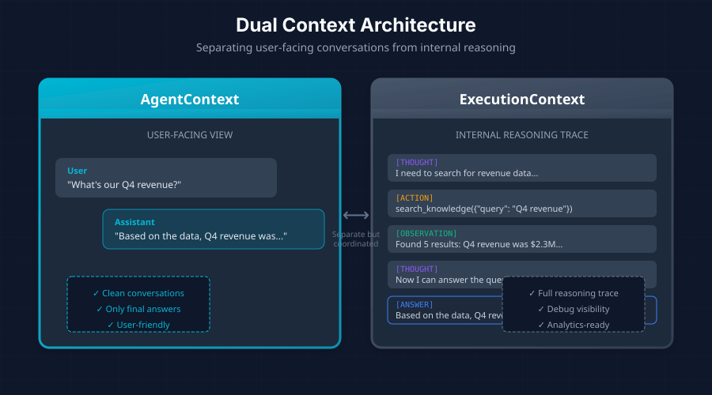

*Understanding the dual-context pattern: AgentContext vs ExecutionContext*

In [Part 2](/posts/building-agentic-agent-part-2-core-architecture), we explored the Profile + Stepper + Executor architecture. Now let's dive into one of its most important design decisions: the separation between user-facing context and internal execution state.

## The Two-Context Problem

When building agentic systems, you quickly encounter a tension:

- **Users** want clean conversations—they ask a question, they get an answer
- **Debugging** requires full visibility—every reasoning step, every tool call
- **Different steppers** rebuild message histories differently (ReAct uses text markers, FunctionCalling uses structured tool calls)

Mixing these concerns creates messy code and confusing user experiences. The solution is **two distinct context types**.

## AgentContext: The User-Facing View

`AgentContext` manages the conversation as the user sees it. It's clean, focused, and doesn't expose internal reasoning:

```
┌────────────────────────────────────┐
│ User: "What's our Q4 revenue?"     │
│ Assistant: "Based on the data..."  │
└────────────────────────────────────┘
    ↑ Only shows final answers
```

The trait definition:

```rust
pub trait AgentContext: Send + Sync {
    // =========================================================================
    // Message Management
    // =========================================================================

    /// Add a message to the context
    fn add_message(&mut self, message: Message);

    /// Get current messages (read-only)
    fn messages(&self) -> &[Message];

    /// Get message count
    fn message_count(&self) -> usize;

    // =========================================================================
    // Event Streaming
    // =========================================================================

    /// Set the event sender for streaming events to the user
    fn set_event_sender(&mut self, sender: mpsc::Sender<AgentEvent>);

    /// Emit an event to the user (if event sender is set)
    fn emit_event(&self, event: AgentEvent);
}
```

## ExecutionContext: The Internal View

`ExecutionContext` provides the full reasoning trace—every thought, action, and observation. It's what you need for debugging, analytics, and step reconstruction:

```
┌────────────────────────────────────┐
│ [THOUGHT] I need to search...      │
│ [ACTION] search_knowledge(...)     │
│ [OBSERVATION] Found 5 results...   │
│ [THOUGHT] Now I can answer...      │
│ [ANSWER] Based on the data...      │
└────────────────────────────────────┘
    ↑ Full reasoning trace
```

The trait definition:

```rust
#[async_trait]
pub trait ExecutionContext: Send + Sync {
    // =========================================================================
    // LLM Methods (delegated with middleware hooks)
    // =========================================================================

    /// Chat with the LLM (middleware hooks applied)
    async fn chat(
        &self,
        context: &mut dyn AgentContext,
        messages: &[Message],
        params: Option<&GenerationParams>,
    ) -> Result<ChatResponse>;

    /// Chat with tools (middleware hooks applied)
    async fn chat_with_tools(
        &self,
        context: &mut dyn AgentContext,
        messages: &[Message],
        tools: &[ToolDefinition],
        params: Option<&GenerationParams>,
    ) -> Result<ChatResponse>;

    /// Streaming chat (middleware hooks applied)
    async fn chat_stream(
        &self,
        context: &mut dyn AgentContext,
        messages: &[Message],
        params: Option<&GenerationParams>,
    ) -> Result<ChatStream>;

    // =========================================================================
    // LLM Info
    // =========================================================================

    fn provider(&self) -> &str;
    fn model(&self) -> &str;

    // =========================================================================
    // Execution Tracking
    // =========================================================================

    /// Get the current iteration number (0-indexed)
    fn iteration(&self) -> usize;

    /// Increment the iteration counter
    fn increment_iteration(&mut self);

    /// Get all steps taken during execution
    fn steps(&self) -> &[AgentStep];

    /// Add a step to the execution history
    fn add_step(&mut self, step: AgentStep);
}
```



## AgentStep: Recording Execution

Each step in the reasoning process is captured as an `AgentStep`:

```rust
pub struct AgentStep {
    /// Step type (thought, action, observation, etc.)
    pub step_type: StepType,

    /// Content of the step
    pub content: String,

    /// Tool used (if applicable)
    pub tool: Option<String>,

    /// Tool call ID from LLM (for function calling)
    pub tool_call_id: Option<String>,

    /// Tool input (if applicable)
    pub tool_input: Option<serde_json::Value>,

    /// Tool output (if applicable)
    pub tool_output: Option<serde_json::Value>,

    /// Timestamp
    pub timestamp: chrono::DateTime<chrono::Utc>,
}

pub enum StepType {
    /// Agent reasoning/thinking
    Thought,
    /// Agent taking action (using a tool)
    Action,
    /// Observation of action result
    Observation,
    /// Final answer
    Answer,
}
```

## Context Implementations

The architecture supports different persistence strategies through multiple implementations:

| Implementation | Use Case | Persistence |
|----------------|----------|-------------|
| `StatelessAgentContext` | Single-turn Q&A, extraction | In-memory only |
| `ChatAgentContext` | Multi-turn conversations | Database + compaction |

### StatelessAgentContext

For simple, single-turn interactions where you don't need to persist history:

```rust
let mut context = StatelessAgentContext::new()
    .with_query("What is X?");

let result = executor.execute(&mut context, None).await?;
```

### ChatAgentContext

For persistent, multi-turn conversations with features like compaction:

```rust
let context = ChatAgentContext::new(
    &chat,
    system_prompt,
    &tools,
    &llm,
    repository,
    compaction_strategy,
).await?;
```

## Benefits of Dual Context

This separation provides several advantages:

1. **Clean user experience**: Users see polished conversations without internal noise
2. **Full debugging visibility**: Developers can trace every reasoning step
3. **Flexible step reconstruction**: Different steppers can rebuild message histories in their own format
4. **Analytics-ready**: Steps can be persisted for analysis and optimization
5. **Testability**: Each context type can be tested independently

## How Steppers Use Both Contexts

When a stepper executes a step, it uses both contexts:

```rust
async fn step(
    &self,
    profile: &AgentProfile,
    context: &mut dyn AgentContext,      // User-facing
    exec_ctx: &mut dyn ExecutionContext, // Internal
) -> Result<StepOutcome> {
    // Build messages from profile + user context + execution steps
    let messages = Self::build_messages(profile, context, exec_ctx);

    // Call LLM via execution context (applies middleware)
    let response = exec_ctx.chat(context, &messages, Some(&params)).await?;

    // Record internal step
    exec_ctx.add_step(AgentStep::thought(parsed.thought.clone()));

    // Return outcome for executor to handle
    // ...
}
```

The stepper reads from the user-facing context (what the user asked), records internal reasoning in the execution context, and returns an outcome for the executor to handle.


**Next up**: [Part 4 - The Stepper Pattern: ReAct vs Function Calling](/posts/building-agentic-agent-part-4)


*This series is based on the Ragify agentic architecture, designed for production multi-tenant SaaS applications.*
