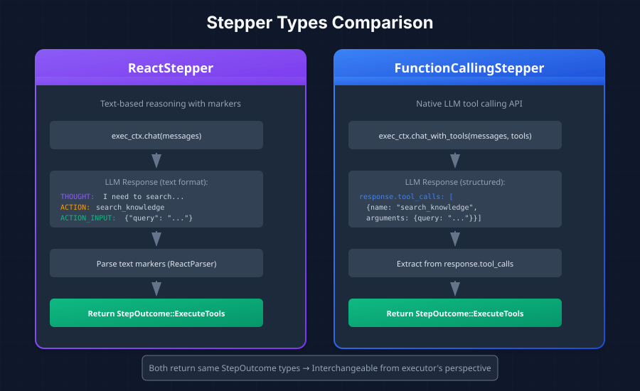

*Implementing different reasoning strategies: ReAct and Function Calling*

In [Part 3](/posts/building-agentic-agent-part-3), we explored the dual-context pattern. Now let's look at the core of agent reasoning: the Stepper.

## What is a Stepper?

A **Stepper** defines HOW an agent executes a single reasoning step. The executor owns the loop and calls `step()` repeatedly; the stepper handles what happens within each iteration.

This separation is powerful because it lets you swap reasoning strategies without changing the execution infrastructure.

```rust
#[async_trait]
pub trait Stepper: Send + Sync {
    /// Execute a single step of the agent loop.
    ///
    /// The stepper:
    /// - Builds messages (from context.messages() + profile.system_prompt)
    /// - Calls the LLM (via exec_ctx) with tools from profile
    /// - Parses the response
    /// - Returns the outcome
    ///
    /// It does NOT:
    /// - Execute tools (executor handles that)
    /// - Manage the loop (executor handles that)
    async fn step(
        &self,
        profile: &AgentProfile,
        context: &mut dyn AgentContext,
        exec_ctx: &mut dyn ExecutionContext,
    ) -> Result<StepOutcome>;

    /// Returns the stepper type
    fn stepper_type(&self) -> StepperType;
}
```

## StepOutcome: What a Step Can Return

Each step returns a `StepOutcome` that tells the executor what to do next:

```rust
pub enum StepOutcome {
    /// Continue to next iteration (internal state updated)
    Continue,

    /// Execute the specified tools, then continue
    ExecuteTools(Vec<ToolExecution>),

    /// Execution complete with result
    Complete(serde_json::Value),

    /// Execution failed with error message
    Failed(String),
}

pub struct ToolExecution {
    /// Unique ID for this tool call (from LLM)
    pub id: String,
    /// Name of the tool to execute
    pub name: String,
    /// Arguments for the tool (JSON)
    pub arguments: serde_json::Value,
}
```

The key insight: **steppers don't execute tools**. They parse the LLM's intent and return `ExecuteTools`, letting the executor handle the actual dispatch.

## Two Stepper Types

| Stepper | Mechanism | Best For |
|---------|-----------|----------|
| `FunctionCallingStepper` | Native LLM tool calling API | OpenAI, Anthropic, Gemini with structured output |
| `ReactStepper` | Text parsing (THOUGHT/ACTION/OBSERVATION) | Any LLM, explicit reasoning traces |



## ReactStepper: Text-Based Reasoning

The `ReactStepper` implements the ReAct (Reasoning + Acting) pattern using text markers. It works with any LLM because it doesn't require native function calling support.

### Implementation

```rust
pub struct ReactStepper {
    parser: ReactParser,
}

impl ReactStepper {
    pub fn new() -> Self {
        Self {
            parser: ReactParser::new(),
        }
    }
}

#[async_trait]
impl Stepper for ReactStepper {
    async fn step(
        &self,
        profile: &AgentProfile,
        agent_ctx: &mut dyn AgentContext,
        exec_ctx: &mut dyn ExecutionContext,
    ) -> Result<StepOutcome> {
        // 1. Build messages from profile + context + execution steps
        let messages = Self::build_messages(profile, agent_ctx, exec_ctx);

        // 2. Build generation params from profile
        let params = profile.generation_params();

        // 3. Call LLM via ExecutionContext (applies middleware hooks)
        let response = exec_ctx.chat(agent_ctx, &messages, Some(&params)).await?;

        // 4. Parse the response
        let parsed = self.parser.parse(&response.content).await?;

        // 5. Record thought in execution context (internal reasoning)
        if !parsed.thought.is_empty() {
            exec_ctx.add_step(AgentStep::thought(parsed.thought.clone()));
        }

        // 6. Return appropriate StepOutcome
        if let Some(answer) = parsed.answer {
            exec_ctx.add_step(AgentStep::answer(answer.clone()));
            return Ok(StepOutcome::complete_text(answer));
        }

        if let Some(action_name) = parsed.action {
            let input_json = parsed.action_input
                .map(|s| serde_json::from_str(&s).unwrap_or(json!({})))
                .unwrap_or(json!({}));

            exec_ctx.add_step(AgentStep::action(action_name.clone(), input_json.clone()));

            return Ok(StepOutcome::ExecuteTools(vec![
                ToolExecution::new(
                    uuid::Uuid::new_v4().to_string(),
                    action_name,
                    input_json
                )
            ]));
        }

        Ok(StepOutcome::failed("Agent provided neither action nor answer"))
    }

    fn stepper_type(&self) -> StepperType {
        StepperType::React
    }
}
```

### Building Messages

The ReAct stepper combines messages from multiple sources:

```rust
impl ReactStepper {
    fn build_messages(
        profile: &AgentProfile,
        context: &dyn AgentContext,
        exec_ctx: &dyn ExecutionContext,
    ) -> Vec<Message> {
        let mut messages = Vec::new();

        // 1. Add ReAct system prompt (format instructions + tools)
        let react_prompt = ReactSystemPrompt {
            context_prompt: Some(profile.system_prompt.clone()),
            tools: profile.tools.iter().map(/* convert */).collect(),
        };
        messages.push(Message::system(react_prompt.render()?));

        // 2. Add user-facing messages from context
        messages.extend(context.messages().iter().cloned());

        // 3. Add reasoning steps from execution context
        for step in exec_ctx.steps() {
            let (role, content) = Self::step_to_message(step);
            messages.push(Message { role, content, tool_calls: None, tool_call_id: None });
        }

        messages
    }

    fn step_to_message(step: &AgentStep) -> (Role, String) {
        match step.step_type {
            StepType::Thought => (Role::Assistant, format!("THOUGHT: {}", step.content)),
            StepType::Action => {
                let input = step.tool_input.clone().unwrap_or(json!({}));
                let tool = step.tool.as_deref().unwrap_or("unknown");
                (Role::Assistant, format!("ACTION: {}\nACTION_INPUT: {}", tool, input))
            }
            StepType::Observation => (Role::User, format!("OBSERVATION: {}", step.content)),
            StepType::Answer => (Role::Assistant, step.content.clone()),
        }
    }
}
```

### Execution Flow

```
LLM Response:
"THOUGHT: I need to search for revenue data
ACTION: search_knowledge
ACTION_INPUT: {"query": "Q4 revenue"}"
     │
     ▼
Parser extracts action
     │
     ▼
Executor executes tool
     │
     ▼
Next LLM call sees formatted text history
```

## FunctionCallingStepper: Native Tool Calling

The `FunctionCallingStepper` uses the LLM's native function calling API instead of text parsing. It's cleaner when supported, but requires provider-specific integration.

### Key Differences

| Aspect | ReactStepper | FunctionCallingStepper |
|--------|--------------|------------------------|
| LLM Call | `exec_ctx.chat()` | `exec_ctx.chat_with_tools()` |
| Response Parsing | Text markers | `response.tool_calls` |
| Tool Input Storage | JSON string | Structured JSON |
| Message Reconstruction | Text format | Tool messages with `tool_call_id` |

### When to Use Each

| Use Case | Recommended Stepper |
|----------|-------------------|
| Tool calling with OpenAI/Anthropic/Gemini | FunctionCalling |
| Explicit reasoning traces | React |
| Structured extraction (no tools) | FunctionCalling + response_format |
| Models without function calling | React |

## Choosing a Stepper

The choice often depends on your LLM provider and debugging needs:

- **FunctionCalling** provides cleaner integration with modern LLMs but less visibility into reasoning
- **React** works universally and shows explicit reasoning, but requires text parsing

Both steppers produce the same `StepOutcome` types, so they're interchangeable from the executor's perspective.

**Next up**: [Part 5 - Middleware Pipeline: Cross-Cutting Concerns →](/posts/building-agentic-agent-part-5)

*This series is based on the Ragify agentic architecture, designed for production multi-tenant SaaS applications.*
