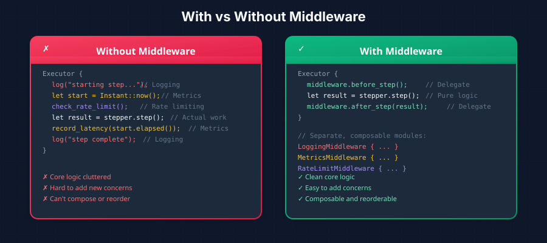
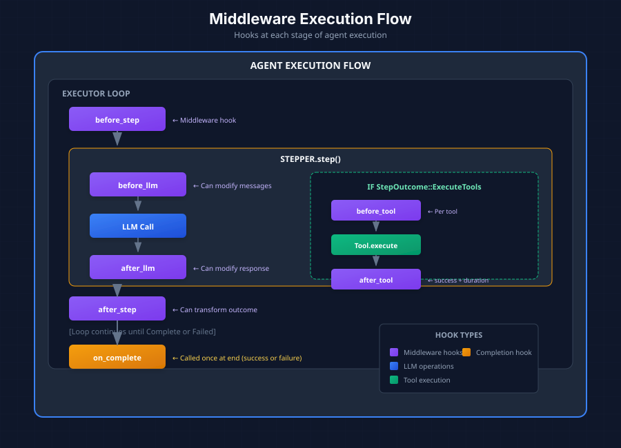

*Adding cross-cutting concerns without polluting core logic*

In [Part 4](/posts/building-agentic-agent-part-4), we explored how steppers implement different reasoning strategies. Now let's look at how to add logging, metrics, rate limiting, and other concerns without modifying core agent code.

## The Problem with Cross-Cutting Concerns

Without middleware, adding observability features means modifying the executor directly:

```rust
// Without Middleware - everything mixed together
Executor {
    log("starting step...");           // Logging
    let start = Instant::now();        // Metrics
    check_rate_limit();                // Rate limiting
    let result = stepper.step();       // Actual work
    record_latency(start.elapsed());   // More metrics
    log("step complete");              // More logging
}
```

This approach has serious problems:
- Core logic becomes cluttered
- Adding new concerns requires modifying the executor
- Concerns can't be composed or reordered
- Testing becomes difficult

## Middleware: Composable Interceptors

Middleware provides hooks that wrap operations with before/after logic:

```rust
// With Middleware - clean separation
Executor {
    middleware.before_step();          // Delegate to middleware
    let result = stepper.step();       // Pure core logic
    middleware.after_step(result);     // Delegate to middleware
}

// Concerns are separate, composable modules:
LoggingMiddleware { ... }
MetricsMiddleware { ... }
RateLimitMiddleware { ... }
```



Think of middleware as **interceptors** that can:
- **Observe**: Log, measure, audit what's happening
- **Modify**: Transform messages, responses, or outcomes
- **Control**: Rate limit, retry, or abort operations

## Where Hooks Are Called

Middleware hooks are called at specific points during agent execution:



The hooks and their positions:

1. **before_step** - Before each reasoning step begins
2. **before_llm** - Before calling the LLM (can modify messages)
3. **after_llm** - After LLM response (can modify response)
4. **after_step** - After step completes (can transform outcome)
5. **before_tool** - Before each tool execution
6. **after_tool** - After tool execution (includes success/duration)
7. **on_complete** - Once at the end (success or failure)

## The Onion Model

Multiple middleware execute in **onion order**—first registered runs first on "before" hooks, last on "after" hooks:

```
Request flow (before_*):    M1 → M2 → M3 → [Operation]
Response flow (after_*):    [Operation] → M3 → M2 → M1
```

Visualized:

```
┌─────────────────────────────────────────────────────┐
│  M1.before_llm()                                    │
│    ┌─────────────────────────────────────────────┐  │
│    │  M2.before_llm()                            │  │
│    │    ┌─────────────────────────────────────┐  │  │
│    │    │  M3.before_llm()                    │  │  │
│    │    │    ┌─────────────────────────────┐  │  │  │
│    │    │    │       LLM.chat()            │  │  │  │
│    │    │    └─────────────────────────────┘  │  │  │
│    │    │  M3.after_llm()                     │  │  │
│    │    └─────────────────────────────────────┘  │  │
│    │  M2.after_llm()                             │  │
│    └─────────────────────────────────────────────┘  │
│  M1.after_llm()                                     │
└─────────────────────────────────────────────────────┘
```

This allows outer middleware to measure total time including inner middleware.

## The Middleware Trait

All methods have default no-op implementations, so you only implement hooks you need:

```rust
#[async_trait]
pub trait Middleware: Send + Sync {
    /// Unique identifier for this middleware
    fn id(&self) -> MiddlewareId;

    /// Before each reasoning step
    async fn before_step(
        &self,
        profile: &AgentProfile,
        ctx: &mut dyn AgentContext
    ) -> Result<()> {
        Ok(())
    }

    /// After each step - can TRANSFORM the outcome
    async fn after_step(
        &self,
        profile: &AgentProfile,
        ctx: &mut dyn AgentContext,
        outcome: StepOutcome
    ) -> Result<StepOutcome> {
        Ok(outcome)
    }

    /// Before LLM call - can MODIFY messages
    async fn before_llm(
        &self,
        ctx: &mut dyn AgentContext,
        messages: &mut Vec<Message>,
        tools: &[ToolDefinition]
    ) -> Result<()> {
        Ok(())
    }

    /// After LLM call - can inspect/modify response
    async fn after_llm(
        &self,
        ctx: &mut dyn AgentContext,
        response: &mut ChatResponse
    ) -> Result<()> {
        Ok(())
    }

    /// Before tool execution
    async fn before_tool(
        &self,
        ctx: &mut dyn AgentContext,
        tool_name: &str
    ) -> Result<()> {
        Ok(())
    }

    /// After tool execution - includes success flag and duration
    async fn after_tool(
        &self,
        ctx: &mut dyn AgentContext,
        tool_name: &str,
        success: bool,
        duration_ms: u64
    ) -> Result<()> {
        Ok(())
    }

    /// When execution completes (success or failure)
    async fn on_complete(
        &self,
        ctx: &dyn AgentContext,
        result: &AgentExecutionResult
    ) -> Result<()> {
        Ok(())
    }
}
```

## Common Use Cases

| Use Case | Hook | What It Does |
|----------|------|--------------|
| **Logging** | `on_complete` | Print execution summary with all steps |
| **Metrics** | `after_llm`, `after_tool` | Record latency, token usage, success rates |
| **Rate Limiting** | `before_llm` | Sleep or reject if too many requests |
| **Context Window** | `before_llm` | Truncate/summarize if messages too long |
| **RAG Injection** | `before_llm` | Retrieve and inject relevant context |
| **Retry Logic** | `after_step` | Transform `Failed` → `Continue` with backoff |
| **Guardrails** | `after_llm` | Check response for policy violations |
| **Caching** | `before_llm` | Return cached response, skip LLM call |

## Example: LoggingMiddleware

A simple middleware that prints execution summaries:

```rust
pub struct LoggingMiddleware {
    id: MiddlewareId,
}

#[async_trait]
impl Middleware for LoggingMiddleware {
    fn id(&self) -> MiddlewareId {
        self.id.clone()
    }

    async fn on_complete(
        &self,
        _ctx: &dyn AgentContext,
        result: &AgentExecutionResult,
    ) -> Result<()> {
        println!("============================================================");
        println!("AGENT EXECUTION SUMMARY");
        println!("============================================================");
        println!("Status: {}", if result.completed { "Completed" } else { "Failed" });
        println!("Iterations: {}", result.iterations);
        println!("Steps: {}", result.steps.len());

        for (i, step) in result.steps.iter().enumerate() {
            println!("\n[{}] {:?}", i + 1, step.step_type);
            println!("  {}", step.content);
        }

        println!("\nFINAL ANSWER:\n{}", result.answer);
        Ok(())
    }
}
```

## Example: MetricsMiddleware

A middleware that records performance metrics:

```rust
struct MetricsMiddleware {
    id: MiddlewareId,
    // metrics collector, etc.
}

#[async_trait]
impl Middleware for MetricsMiddleware {
    fn id(&self) -> MiddlewareId {
        self.id.clone()
    }

    async fn before_llm(
        &self,
        _ctx: &mut dyn AgentContext,
        messages: &mut Vec<Message>,
        _tools: &[ToolDefinition],
    ) -> Result<()> {
        let token_estimate = estimate_tokens(messages);
        self.record_input_tokens(token_estimate);
        Ok(())
    }

    async fn after_llm(
        &self,
        _ctx: &mut dyn AgentContext,
        response: &mut ChatResponse,
    ) -> Result<()> {
        if let Some(usage) = &response.usage {
            self.record_output_tokens(usage.completion_tokens);
        }
        Ok(())
    }

    async fn after_tool(
        &self,
        _ctx: &mut dyn AgentContext,
        tool_name: &str,
        success: bool,
        duration_ms: u64,
    ) -> Result<()> {
        self.record_tool_execution(tool_name, success, duration_ms);
        Ok(())
    }
}
```

## Adding Middleware to Executors

```rust
let mut executor = AgentExecutor::new(profile, tools, llm);
executor.add_middleware(Arc::new(LoggingMiddleware::new()));
executor.add_middleware(Arc::new(MetricsMiddleware::new()));
executor.add_middleware(Arc::new(RateLimitMiddleware::new()));
```

The order of registration matters—earlier middleware wrap later ones in the onion model.

**Next up**: [Part 6 - Building Tools: Type-Safe Agent Capabilities →](/posts/building-agentic-agent-part-6)


*This series is based on the Ragify agentic architecture, designed for production multi-tenant SaaS applications.*
