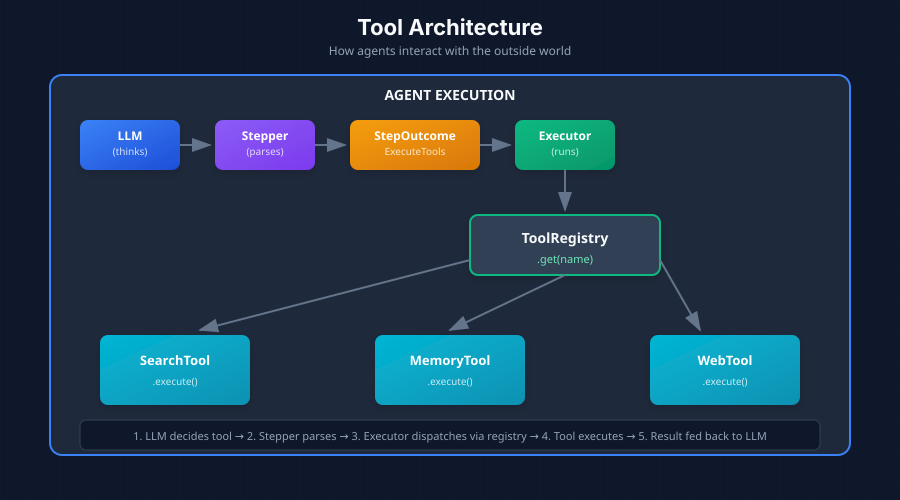

*Creating type-safe, composable tools for your agents*

In [Part 5](/posts/building-agentic-agent-part-5), we explored middleware for cross-cutting concerns. Now let's look at how agents interact with the outside world through tools.

## What is a Tool?

A **Tool** is the mechanism that allows agents to interact beyond text generation. While LLMs can only generate text, tools give agents the ability to:

- **Retrieve information**: Search databases, query APIs, read files
- **Take actions**: Send emails, create records, execute code
- **Access real-time data**: Check weather, stock prices, current time

Without tools, an agent is limited to its training data. With tools, an agent becomes a capable system that can accomplish real-world tasks.

## How Tools Fit in the Architecture



The flow:

1. **LLM decides** which tool to use based on `name` and `description`
2. **Stepper parses** the response and returns `StepOutcome::ExecuteTools`
3. **Executor looks up** the tool in `ToolRegistry` by name
4. **Executor calls** `tool.execute(input)` with the LLM-provided arguments
5. **Tool result** is recorded and fed back to the LLM in the next iteration

## Design Decisions

| Design Choice | Rationale |
|---------------|-----------|
| Trait-based | Any struct can be a tool—easy to extend |
| JSON Schema input | LLMs understand JSON; enables validation |
| Async execution | Tools often do I/O (network, disk) |
| Separate output vs data | `output` for LLM, `data` for persistence/analytics |
| Registry pattern | Decouple tool creation from execution |

## The Tool Trait

```rust
#[async_trait]
pub trait Tool: Send + Sync {
    /// Get the tool's unique name
    fn name(&self) -> &str;

    /// Get the tool's description (used by LLM for tool selection)
    fn description(&self) -> &str;

    /// Get the tool's input schema (JSON Schema format)
    fn input_schema(&self) -> JsonValue;

    /// Execute the tool with given input
    async fn execute(&self, input: ToolInput) -> Result<ToolResult, ToolError>;

    /// Get examples of tool usage (optional)
    fn examples(&self) -> Vec<ToolExample> { vec![] }
}
```

## ToolInput: Type-Safe Parameter Extraction

`ToolInput` wraps the arguments the LLM provides when calling a tool:

```rust
pub struct ToolInput {
    pub tool: String,           // Tool name (for logging/routing)
    pub parameters: JsonValue,  // Arguments from LLM
}

impl ToolInput {
    /// Extract a required parameter
    pub fn get<T: Deserialize>(&self, key: &str) -> Result<T, ToolError> { ... }

    /// Extract an optional parameter
    pub fn get_optional<T: Deserialize>(&self, key: &str) -> Option<T> { ... }

    /// Parse entire parameters into a typed struct (recommended)
    pub fn parse<T: DeserializeOwned>(&self) -> Result<T, ToolError> { ... }
}
```

The recommended pattern—define a typed input struct:

```rust
#[derive(Deserialize, JsonSchema)]
struct SearchInput {
    query: String,
    limit: Option<u32>,
}

async fn execute(&self, input: ToolInput) -> Result<ToolResult, ToolError> {
    let params: SearchInput = input.parse()?;  // Type-safe extraction
    // Use params.query, params.limit...
}
```

## ToolResult: Dual Output

`ToolResult` has two output fields serving different purposes:

| Field | Purpose | Consumer |
|-------|---------|----------|
| `output` | Human-readable text | LLM (for reasoning) |
| `data` | Structured JSON | System (for persistence, analytics) |

```rust
pub struct ToolResult {
    pub tool: String,              // Which tool executed
    pub output: String,            // Text for LLM consumption
    pub data: Option<JsonValue>,   // Structured data for system use
    pub success: bool,             // Did it work?
    pub error: Option<String>,     // Error message if failed
}
```

**Why two outputs?** The LLM doesn't need raw JSON—a summary is more token-efficient. But the system may want structured data for logging or further processing.

```rust
// Example: Search tool returns both
ToolResult::success("search", "Found 3 documents about Rust async")
    .with_data(json!({
        "count": 3,
        "documents": [...]  // Full data for system
    }))
```

## ToolRegistry: Managing Available Tools

`ToolRegistry` holds all available tools for an agent:

```rust
pub struct ToolRegistry {
    tools: HashMap<String, Arc<dyn Tool>>,
}

impl ToolRegistry {
    pub fn new() -> Self { ... }

    /// Register a tool (builder pattern)
    pub fn register(&mut self, tool: Arc<dyn Tool>) -> &mut Self { ... }

    /// Look up tool by name
    pub fn get(&self, name: &str) -> Option<Arc<dyn Tool>> { ... }

    /// Execute a tool by name
    pub async fn execute(&self, input: ToolInput) -> Result<ToolResult, ToolError> { ... }

    /// Generate tool descriptions for LLM prompt/API
    pub fn tool_descriptions(&self) -> Vec<ToolDescription> { ... }
}
```

Usage:

```rust
let mut registry = ToolRegistry::new();
registry
    .register(Arc::new(SearchTool::new()))
    .register(Arc::new(MemoryTool::new()))
    .register(Arc::new(WebSearchTool::new()));

// Pass to executor
let executor = AgentExecutor::new(profile, Arc::new(registry), llm);
```

## Complete Tool Implementation Example

```rust
use schemars::JsonSchema;

#[derive(Deserialize, JsonSchema)]
struct SearchInput {
    /// Search query string
    query: String,
    /// Maximum number of results
    #[serde(default = "default_limit")]
    limit: u32,
}

fn default_limit() -> u32 { 10 }

pub struct SearchTool {
    knowledge_base: Arc<KnowledgeBase>,
}

#[async_trait]
impl Tool for SearchTool {
    fn name(&self) -> &str {
        "search_knowledge"
    }

    fn description(&self) -> &str {
        "Search the knowledge base for relevant information"
    }

    fn input_schema(&self) -> serde_json::Value {
        schemars::schema_for!(SearchInput)
    }

    async fn execute(&self, input: ToolInput) -> Result<ToolResult, ToolError> {
        // Type-safe input parsing
        let params: SearchInput = input.parse()?;

        // Execute search logic
        let results = self.knowledge_base
            .search(&params.query, params.limit)
            .await
            .map_err(|e| ToolError::ExecutionFailed(e.to_string()))?;

        // Return both LLM-friendly output and structured data
        Ok(ToolResult::success(
            self.name(),
            format!("Found {} results for '{}'", results.len(), params.query)
        ).with_data(serde_json::to_value(&results)?))
    }
}

// Register
let mut registry = ToolRegistry::new();
registry.register(Arc::new(SearchTool::new(knowledge_base)));
```

## Best Practices for Tool Design

### 1. Clear, Focused Names and Descriptions

```rust
// Good: Clear, focused tools with typed input
fn name(&self) -> &str { "search_knowledge" }
fn description(&self) -> &str {
    "Search the knowledge base for relevant information"
}

// Bad: Vague, overly broad tools
fn name(&self) -> &str { "do_stuff" }
```

### 2. Handle Failures Gracefully

Tools should return errors via `ToolResult`, not panic:

```rust
async fn execute(&self, input: ToolInput) -> Result<ToolResult, ToolError> {
    let params: MyInput = input.parse()?;

    match self.internal_call(&params).await {
        Ok(result) => Ok(ToolResult::success(self.name(), result)
            .with_data(serde_json::to_value(result)?)),
        Err(e) => Ok(ToolResult::failure(self.name(), format!("Failed: {}", e))),
    }
}
```

### 3. Use JSON Schema for Validation

Deriving `JsonSchema` from `schemars` generates schemas automatically:

```rust
#[derive(Deserialize, JsonSchema)]
struct SearchInput {
    /// Search query string (this becomes the schema description)
    query: String,
    /// Maximum results to return
    #[serde(default = "default_limit")]
    limit: u32,
}
```


**Next up**: [Part 7 - Putting It All Together: Complete Implementation →](/posts/building-agentic-agent-part-7)


*This series is based on the Reflexify agentic architecture, designed for production multi-tenant SaaS applications.*
