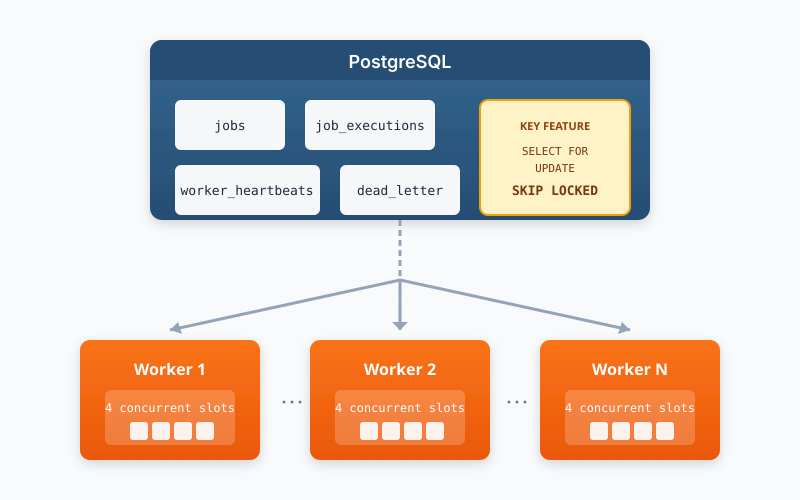

This is Part 1 of a 5-part series on building production-grade distributed job processing systems in Rust using PostgreSQL.

---

### The Problem with Traditional Message Brokers

When architects design distributed systems, the reflexive choice for background job processing is often a dedicated message broker—Redis with Sidekiq, RabbitMQ, or Amazon SQS. These tools are battle-tested and purpose-built for queuing workloads.

But they come with hidden costs:

**Operational Complexity**: Another service to deploy, monitor, secure, and scale. Another point of failure in your architecture. Another set of credentials to manage.

**Data Consistency Challenges**: Your job data lives in the broker while your business data lives in PostgreSQL. What happens when you need transactional guarantees across both? You're suddenly dealing with distributed transactions, saga patterns, or eventual consistency headaches.

**Infrastructure Sprawl**: For many applications, especially in the early-to-mid growth stage, the message broker becomes yet another piece of infrastructure that's overprovisioned "just in case."

### The PostgreSQL Alternative

What if your database could also be your job queue? PostgreSQL, with its robust locking primitives and transactional guarantees, is surprisingly well-suited for this task. The key enabling feature is `SELECT FOR UPDATE SKIP LOCKED`—a powerful mechanism that makes concurrent job dequeuing both safe and efficient.

This approach gives you:

- **Transactional Integrity**: Enqueue jobs in the same transaction as your business logic. No two-phase commits required.
- **Simplified Operations**: One fewer service to manage. Your existing PostgreSQL monitoring, backups, and scaling strategies apply to your job queue.
- **Strong Consistency**: Query job status with standard SQL. Join job data with business data. No sync issues.
- **Proven Reliability**: PostgreSQL's durability guarantees extend to your job queue automatically.

### Architecture Overview

Our distributed job processing system follows a worker-pool pattern where multiple workers compete fairly for jobs stored in PostgreSQL:

The architecture consists of four core database tables:

| Table               | Purpose                                                            |
| ------------------- | ------------------------------------------------------------------ |
| `jobs`              | The primary job queue—stores pending, running, and completed jobs  |
| `job_executions`    | Audit trail of every execution attempt for debugging and analytics |
| `worker_heartbeats` | Tracks active workers for distributed coordination                 |
| `dead_letter_jobs`  | Quarantine for jobs that fail repeatedly                           |

Workers connect to PostgreSQL and compete for jobs using atomic dequeue operations. Each worker can process multiple jobs concurrently using a semaphore-based slot system—think of it as a configurable "concurrent job limit" per worker.

### The Ten Pillars of Reliable Job Processing

Building a production-grade system requires more than just dequeuing jobs. Throughout this series, we'll explore ten critical techniques:

1. **SELECT FOR UPDATE SKIP LOCKED** — Safe concurrent dequeuing without message duplication
2. **Lease-Based Ownership** — Preventing zombie jobs through time-bounded ownership
3. **Execution ID Verification** — Avoiding split-brain scenarios in distributed systems
4. **Stale Job Reclamation** — Automatic recovery from worker failures
5. **Semaphore Concurrency Control** — Backpressure and resource management
6. **Dead Letter Queues** — Graceful handling of persistent failures
7. **Graceful Shutdown** — Clean termination without job loss
8. **Job Cancellation** — External control over running jobs
9. **Handler Registry Pattern** — Extensible, type-safe job processing
10. **Multi-Tenant Isolation** — Secure job processing in SaaS environments

### What Makes Rust Ideal for This?

Rust's type system and async runtime make it particularly well-suited for building job processing infrastructure:

**Memory Safety Without GC**: Long-running worker processes benefit from predictable memory usage without garbage collection pauses affecting job latency.

**Async/Await with Tokio**: The Tokio runtime provides excellent primitives for concurrent job processing—semaphores, channels, cancellation tokens, and timeout handling all come built-in.

**Strong Typing**: Job handlers can leverage Rust's type system to ensure payloads are deserialized correctly and errors are handled explicitly.

**Performance**: When your job queue lives in PostgreSQL, efficient connection pooling and query execution matter. Rust's zero-cost abstractions deliver here.

### Coming Up Next

In Part 2, we'll dive deep into the core mechanism that makes this architecture work: `SELECT FOR UPDATE SKIP LOCKED`. You'll see the exact SQL query that atomically dequeues jobs, creates execution records, and updates job status—all in a single round-trip to the database.

---

Continue to [Part 2: The Core — SELECT FOR UPDATE SKIP LOCKED](/posts/distributed-background-job-processing-in-rust-and-postgresql-part-2)
