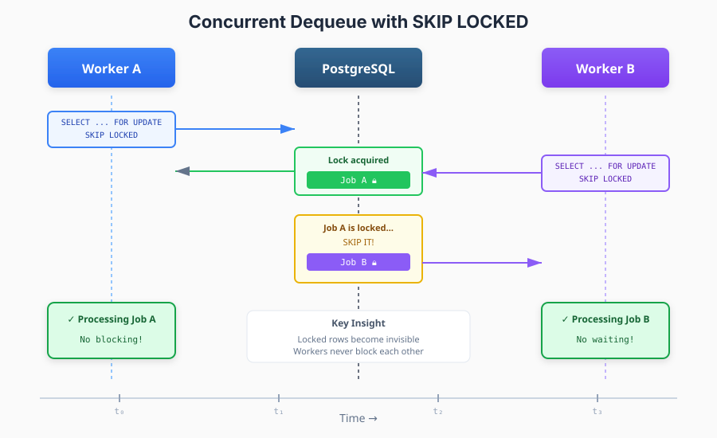

This is Part 2 of a 5-part series on building production-grade distributed job processing systems in Rust using PostgreSQL.


### The Challenge of Concurrent Dequeuing

Imagine ten workers all trying to grab the next job from a queue at the exact same moment. Without proper coordination, you get chaos:

- **Race Conditions**: Multiple workers grab the same job
- **Blocking**: Workers wait in line for locks, killing throughput
- **Starvation**: Some workers never get work while others hog everything

Traditional solutions involve external coordinators, distributed locks, or message brokers. But PostgreSQL gives us something elegant: `FOR UPDATE SKIP LOCKED`.

### Understanding SKIP LOCKED

The magic lies in three words: **skip locked rows**. When a transaction locks a row with `FOR UPDATE`, that row becomes invisible to other transactions using `SKIP LOCKED`. No blocking, no waiting—just graceful skipping.



Here's the mental model:

1. Worker A executes `SELECT FOR UPDATE SKIP LOCKED` and locks Job #1
2. Worker B executes the same query milliseconds later
3. Instead of blocking on Job #1, Worker B's query **skips it entirely** and returns Job #2
4. Both workers proceed without any coordination overhead

### The Atomic Dequeue Query

Our dequeue operation does four things in a single atomic query:

1. **Select** the highest-priority pending job
2. **Lock** it to prevent other workers from seeing it
3. **Create** an execution record for audit/debugging
4. **Update** the job status to "running"

Here's the actual SQL using Common Table Expressions (CTEs):

```sql
WITH selected_job AS (
    -- Step 1: Find and lock the best available job
    SELECT id FROM jobs
    WHERE status = 'pending'
      AND scheduled_at <= NOW()
      AND attempts < max_attempts
      AND queue_name = ANY($3)    -- Filter by queue names
    ORDER BY priority DESC, scheduled_at ASC
    FOR UPDATE SKIP LOCKED
    LIMIT 1
),
execution AS (
    -- Step 2: Create execution record
    INSERT INTO job_executions (job_id, worker_id, started_at, status)
    SELECT id, $1, NOW(), 'running'
    FROM selected_job
    RETURNING id as execution_id, job_id
),
dequeued AS (
    -- Step 3: Update job to running state
    UPDATE jobs
    SET status = 'running',
        locked_by = $1,
        current_execution_id = execution.execution_id,
        lease_expires_at = NOW() + $2 * INTERVAL '1 second',
        attempts = attempts + 1
    FROM execution
    WHERE jobs.id = execution.job_id
    RETURNING jobs.*
)
SELECT * FROM dequeued
```

### Breaking Down the Query

**The SELECT with SKIP LOCKED**

```sql
SELECT id FROM jobs
WHERE status = 'pending'
  AND scheduled_at <= NOW()          -- Respect scheduled time
  AND attempts < max_attempts         -- Don't retry exhausted jobs
  AND queue_name = ANY($3)           -- Queue filtering
ORDER BY priority DESC, scheduled_at ASC
FOR UPDATE SKIP LOCKED
LIMIT 1
```

The ordering is critical: `priority DESC` ensures high-priority jobs jump the queue, while `scheduled_at ASC` provides FIFO ordering within the same priority level.

**The Execution Record**

```sql
INSERT INTO job_executions (job_id, worker_id, started_at, status)
SELECT id, $1, NOW(), 'running'
FROM selected_job
RETURNING id as execution_id, job_id
```

This creates an audit trail. If the job fails, we'll update this record with error details. The execution history becomes invaluable for debugging production issues.

**The Status Update**

```sql
UPDATE jobs
SET status = 'running',
    locked_by = $1,
    current_execution_id = execution.execution_id,
    lease_expires_at = NOW() + $2 * INTERVAL '1 second',
    attempts = attempts + 1
FROM execution
WHERE jobs.id = execution.job_id
```

Note the `lease_expires_at` field—this is crucial for reliability. If the worker crashes, we need to know when it's safe to reclaim the job. We'll explore this in Part 3.

### Rust Implementation

Here's how we wrap this query in Rust using `sqlx`:

```rust
pub async fn dequeue_job(
    &self,
    worker_id: &str,
    lease_duration_seconds: i64,
    queue_names: &[String],
) -> Result<Option<Job>> {
    let job = sqlx::query_as::<_, Job>(DEQUEUE_JOB_SQL)
        .bind(worker_id)
        .bind(lease_duration_seconds)
        .bind(queue_names)
        .fetch_optional(&self.pool)
        .await?;

    Ok(job)
}
```

The beauty of this approach:

- **One round trip**: Everything happens in a single database call
- **Atomic**: No partial states possible—the job is either dequeued or not
- **Non-blocking**: Workers never wait for each other
- **No external coordination**: PostgreSQL handles all the locking

### Performance Considerations

**Indexing is Critical**

For the `SKIP LOCKED` query to perform well, you need proper indexes:

```sql
CREATE INDEX idx_jobs_pending ON jobs (
    priority DESC,
    scheduled_at ASC
)
WHERE status = 'pending';
```

This partial index only covers pending jobs, keeping it small and fast even as your completed job count grows.

**Connection Pooling**

Each dequeue operation holds a brief lock. With proper connection pooling (we use `sqlx` with configurable pool size), you can support hundreds of workers without connection exhaustion.

**Queue Partitioning**

The `queue_name = ANY($3)` filter lets workers specialize. You might have:

- `critical` queue: Fast workers, small jobs, high priority
- `bulk` queue: Fewer workers, large batch jobs
- `scheduled` queue: Cron-like scheduled tasks

Workers can subscribe to multiple queues with priority ordering.

### When SKIP LOCKED Isn't Enough

While `SKIP LOCKED` handles concurrent dequeuing beautifully, it doesn't solve everything:

- **Worker Crashes**: What if a worker grabs a job and dies?
- **Long-Running Jobs**: How do we know a job is still being processed?
- **Split Brain**: What if a "dead" worker comes back to life?

These scenarios require additional mechanisms: leases, heartbeats, and execution ID verification. We'll tackle these in Part 3.

### Summary

`SELECT FOR UPDATE SKIP LOCKED` transforms PostgreSQL into an efficient job queue by:

1. **Eliminating blocking**: Workers skip locked rows instead of waiting
2. **Ensuring fairness**: Each job goes to exactly one worker
3. **Enabling atomicity**: Dequeue, record, and update in one operation
4. **Scaling horizontally**: Add workers without coordination overhead

The key insight is that we're leveraging PostgreSQL's battle-tested concurrency primitives instead of building our own distributed coordination layer.

---

Continue to [Part 3: Reliability Through Leases & Heartbeats](/posts/distributed-background-job-processing-in-rust-and-postgresql-part-3)

Previous: [Part 1: Introduction & Architecture Overview](/posts/distributed-background-job-processing-in-rust-and-postgresql-part-1-introduction)
