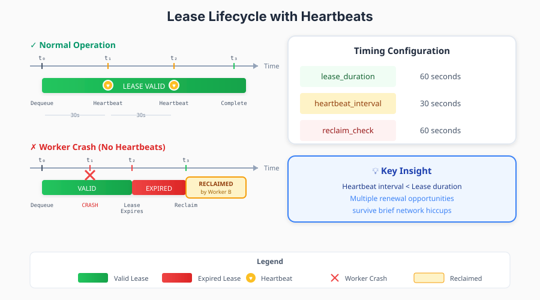
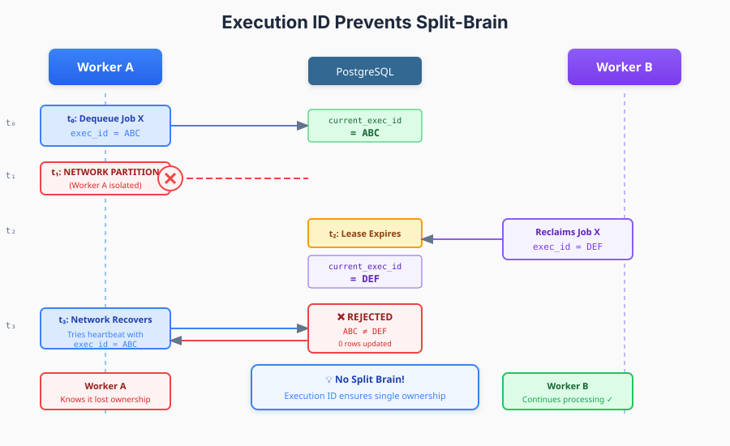

## Part 3: Reliability Through Leases & Heartbeats

*This is Part 3 of a 5-part series on building production-grade distributed job processing systems in Rust using PostgreSQL.*

### The Zombie Job Problem

In Part 2, we built a beautiful atomic dequeue mechanism. But there's a dark scenario lurking: **zombie jobs**.

Picture this timeline:
1. Worker A dequeues Job #42 at 10:00:00
2. Worker A's process crashes at 10:00:05
3. Job #42 is now stuck in "running" status forever
4. Meanwhile, customers are wondering why their email never sent

Without additional mechanisms, this job is orphaned—locked by a dead worker, invisible to `SKIP LOCKED`, never to be processed.

### Lease-Based Ownership

The solution is borrowed from distributed systems: **time-bounded leases**. Instead of owning a job indefinitely, workers acquire a lease that must be periodically renewed.

Every job has a `lease_expires_at` timestamp:

```sql
-- When dequeuing
lease_expires_at = NOW() + 60 seconds  -- 1-minute lease
```

If the worker doesn't renew the lease within 60 seconds, the job becomes eligible for reclamation by another worker.



### The Heartbeat Mechanism

Workers maintain their leases through periodic heartbeats—database updates that extend the `lease_expires_at` timestamp:

```rust
// Spawn heartbeat task for each job being processed
let heartbeat_handle = tokio::spawn(async move {
    let mut interval = interval(Duration::from_secs(
        config.job_heartbeat_interval_seconds,  // e.g., 30 seconds
    ));

    loop {
        interval.tick().await;

        match repository.update_job_heartbeat(
            UpdateJobHeartbeatParams {
                job_id,
                execution_id,
                lease_duration_seconds: config.job_lease_duration_seconds,
            }
        ).await {
            Ok(Some(JobStatus::Cancelled)) => {
                // Job was cancelled externally
                cancel_token.cancel();
                break;
            }
            Ok(None) => {
                // Job was reclaimed by another worker!
                cancel_token.cancel();
                break;
            }
            Ok(Some(_)) => {
                // Lease renewed successfully
            }
            Err(e) => {
                // Log error, consider cancelling if persistent
            }
        }
    }
});
```

**Key timing insight**: The heartbeat interval should be significantly shorter than the lease duration. We use:
- **Lease Duration**: 60 seconds
- **Heartbeat Interval**: 30 seconds

This gives the worker two opportunities to renew before the lease expires, providing resilience against momentary network hiccups.

### Execution ID: Preventing Split Brain

Here's a subtle but critical race condition:

1. Worker A dequeues Job #42, gets `execution_id = ABC`
2. Worker A's network partitions (it's alive but can't reach the database)
3. Lease expires, job is reclaimed
4. Worker B dequeues Job #42, gets `execution_id = DEF`
5. Worker A's network recovers, it tries to complete Job #42

Without additional protection, Worker A would corrupt Worker B's in-progress execution!

The solution: **every operation must verify the execution ID matches**:

```sql
-- Heartbeat update
UPDATE jobs
SET lease_expires_at = NOW() + $2 * INTERVAL '1 second'
WHERE id = $1
  AND current_execution_id = $3  -- Must match!
RETURNING status

-- Job completion
UPDATE jobs
SET status = $2,
    completed_at = NOW(),
    locked_by = NULL,
    current_execution_id = NULL
WHERE id = $1
  AND current_execution_id = $5  -- Must match!
RETURNING id
```



If the execution IDs don't match, the update affects zero rows, and the worker knows it lost ownership. This is how the heartbeat task detects reclamation:

```rust
Ok(None) => {
    // Query returned no rows - we lost ownership
    cancel_token.cancel();
    break;
}
```

### Stale Job Reclamation

A background task periodically scans for jobs with expired leases and reclaims them:

```sql
WITH failed_executions AS (
    -- Mark the stale executions as failed (for audit trail)
    UPDATE job_executions
    SET status = 'failed',
        completed_at = NOW(),
        error_message = 'Job lease expired - execution reclaimed'
    FROM jobs
    WHERE job_executions.id = jobs.current_execution_id
      AND jobs.status = 'running'
      AND jobs.lease_expires_at IS NOT NULL
      AND jobs.lease_expires_at < NOW()
    RETURNING job_executions.job_id
)
-- Reset jobs to pending
UPDATE jobs
SET status = 'pending',
    locked_by = NULL,
    current_execution_id = NULL,
    lease_expires_at = NULL
WHERE id IN (SELECT job_id FROM failed_executions)
```

This query does several things atomically:

1. **Finds expired leases**: `lease_expires_at < NOW()`
2. **Records the failure**: Creates an audit trail in `job_executions`
3. **Resets the job**: Returns it to `pending` status for another worker

The reclamation task runs on every worker at configurable intervals (e.g., every 60 seconds). Multiple workers running this query simultaneously is safe—each job will only be reclaimed once due to the atomic update.

### Rust Implementation: Putting It Together

Here's how the worker orchestrates job processing with heartbeats:

```rust
async fn process_job_task(self: Arc<Self>, job: Job, _permit: OwnedSemaphorePermit) {
    let job_id = job.id;
    let execution_id = job.current_execution_id
        .expect("Job must have execution_id");

    // Create cancellation token for cooperative cancellation
    let cancel_token = CancellationToken::new();

    // Spawn heartbeat task
    let heartbeat_handle = {
        let worker = self.clone();
        let cancel_token = cancel_token.clone();

        tokio::spawn(async move {
            let mut interval = interval(Duration::from_secs(
                worker.inner.config.job_heartbeat_interval_seconds,
            ));

            loop {
                interval.tick().await;

                match worker.inner.repository.update_job_heartbeat(
                    UpdateJobHeartbeatParams {
                        job_id,
                        execution_id,
                        lease_duration_seconds:
                            worker.inner.config.job_lease_duration_seconds,
                    }
                ).await {
                    Ok(None) => {
                        // Lost ownership - signal cancellation
                        cancel_token.cancel();
                        break;
                    }
                    Ok(Some(JobStatus::Cancelled)) => {
                        cancel_token.cancel();
                        break;
                    }
                    _ => {} // Continue heartbeating
                }
            }
        })
    };

    // Create job context with cancellation token
    let job_ctx = JobContext::new(
        Arc::new(self.inner.app_ctx.org_context(job.org_id))
    ).with_cancellation_token(cancel_token.clone());

    // Execute the job handler
    let result = self.execute_job(&job, &job_ctx).await;

    // Stop heartbeat task
    heartbeat_handle.abort();

    // Update job status based on result
    match result {
        Ok(_) => self.mark_job_completed(job_id, execution_id).await,
        Err(e) => self.mark_job_failed(job_id, execution_id, e).await,
    }
}
```

### Configuration Guidelines

Finding the right timing parameters requires balancing responsiveness against overhead:

| Parameter | Recommended | Why |
|-----------|-------------|-----|
| `lease_duration_seconds` | 60-120s | Long enough to survive brief network issues |
| `heartbeat_interval_seconds` | 30-60s | At least 2 heartbeats per lease period |
| `reclaim_check_interval_seconds` | 60s | Matches lease duration |
| `poll_interval_seconds` | 1-5s | Depends on job latency requirements |

**Trade-offs**:
- **Shorter leases**: Faster recovery from failures, but more heartbeat overhead
- **Longer leases**: Less overhead, but orphaned jobs take longer to recover
- **More frequent reclaim checks**: Faster recovery, but more database queries

### Summary

The three-layer reliability system provides defense in depth:

1. **Leases** ensure jobs can't be orphaned forever
2. **Heartbeats** maintain active ownership and detect cancellation
3. **Execution IDs** prevent split-brain when workers recover after partition

Together, these mechanisms guarantee that:
- Every job eventually completes or fails (no zombies)
- Each job is processed by exactly one worker at a time (no duplicates)
- Worker failures are detected and recovered automatically (self-healing)

---

Continue to Part 4: Concurrency, Backpressure & Failure Handling

*Previous: [Part 2: The Core — SELECT FOR UPDATE SKIP LOCKED](/posts/distributed-background-job-processing-in-rust-and-postgresql-part-2)*
