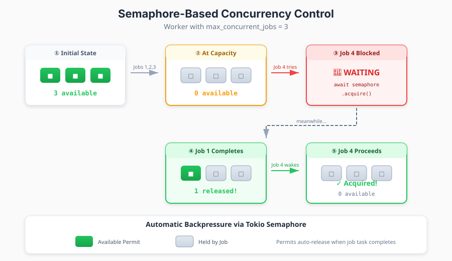
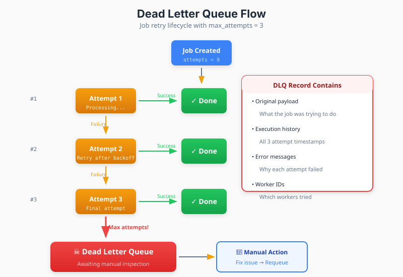

## Part 4: Concurrency, Backpressure & Failure Handling

*This is Part 4 of a 5-part series on building production-grade distributed job processing systems in Rust using PostgreSQL.*

### The Resource Exhaustion Problem

Without concurrency limits, a worker could dequeue jobs faster than it can process them. Memory bloats. Database connections exhaust. The system collapses under its own ambition.

We need **backpressure** — a mechanism that slows down job acquisition when the worker is at capacity.

### Semaphore-Based Concurrency Control

Tokio provides an elegant primitive for this: the **Semaphore**. Think of it as a fixed pool of permits. Each concurrent job slot requires one permit. When all permits are held, the worker waits.

```rust
// Create worker with 4 concurrent job slots
let semaphore = Arc::new(Semaphore::new(config.max_concurrent_jobs));  // e.g., 4
```



The dequeue loop acquires a permit before attempting to fetch a job:

```rust
async fn dequeue_loop(&self) {
    loop {
        // Block until a slot is available OR shutdown signal
        let permit = tokio::select! {
            _ = shutdown_rx.changed() => break,
            result = self.inner.semaphore.clone().acquire_owned() => {
                match result {
                    Ok(permit) => permit,
                    Err(_) => continue,  // Semaphore closed
                }
            }
        };

        // We have a permit - try to get a job
        match self.inner.repository.dequeue_job(...).await {
            Ok(Some(job)) => {
                // Spawn processing task, passing the permit
                let worker = self.clone();
                tokio::spawn(async move {
                    worker.process_job_task(job, permit).await;
                    // permit is dropped here, releasing the slot
                });
            }
            Ok(None) => {
                // No jobs available - release permit and wait
                drop(permit);
                sleep(poll_interval).await;
            }
            Err(e) => {
                drop(permit);
                error!("Dequeue error: {}", e);
                sleep(error_backoff).await;
            }
        }
    }
}
```

**Key insight**: The `permit` moves into the spawned task. It's automatically released when the task completes (success or failure). No manual permit tracking required.

### Why OwnedSemaphorePermit?

Rust's ownership system shines here. We use `acquire_owned()` which returns an `OwnedSemaphorePermit` that can be moved across tasks:

```rust
async fn process_job_task(
    self: Arc<Self>,
    job: Job,
    _permit: OwnedSemaphorePermit,  // Held for lifetime of task
) {
    // ... process job ...
    // _permit dropped when function returns
}
```

The `_permit` parameter exists solely to tie its lifetime to the task. Even if we never reference it, it's released when the task ends.

### Dead Letter Queue: Handling Persistent Failures

Some jobs fail repeatedly despite retries. Maybe the payload is malformed. Maybe an external service is permanently down. These jobs need quarantine, not endless retries.

The **Dead Letter Queue (DLQ)** is a separate table where failed jobs go to await manual inspection:

```sql
CREATE TABLE dead_letter_jobs (
    id UUID PRIMARY KEY,
    original_job_id UUID NOT NULL,
    org_id UUID NOT NULL,
    job_type VARCHAR(255) NOT NULL,
    payload JSONB NOT NULL,
    attempts INT NOT NULL,
    max_attempts INT NOT NULL,
    error_message TEXT,
    execution_history JSONB,  -- All execution attempts
    created_at TIMESTAMPTZ DEFAULT NOW()
);
```



When a job exhausts its retries, we move it atomically:

```sql
WITH job_data AS (
    SELECT * FROM jobs WHERE id = $1
),
execution_history AS (
    -- Aggregate all execution attempts into JSON
    SELECT jsonb_agg(
        jsonb_build_object(
            'id', id,
            'worker_id', worker_id,
            'started_at', started_at,
            'completed_at', completed_at,
            'error_message', error_message
        )
    ) as history
    FROM job_executions
    WHERE job_id = $1
),
inserted AS (
    -- Insert into DLQ
    INSERT INTO dead_letter_jobs (
        original_job_id, org_id, job_type, payload,
        attempts, max_attempts, error_message, execution_history
    )
    SELECT
        id, org_id, job_type, payload,
        attempts, max_attempts, $2, history
    FROM job_data CROSS JOIN execution_history
    RETURNING *
),
deleted AS (
    -- Remove from main queue
    DELETE FROM jobs WHERE id = $1
)
SELECT * FROM inserted
```

The DLQ preserves everything needed for debugging:
- **Original payload**: What was the job trying to do?
- **Execution history**: When did each attempt run? Which workers?
- **Error messages**: What went wrong each time?

### Graceful Shutdown

When deploying new code or scaling down, workers should finish their current work before exiting. Abrupt termination means jobs return to the queue (after lease expiry), but graceful shutdown is cleaner.

The strategy:

1. **Signal shutdown**: Broadcast to all internal loops
2. **Stop accepting**: Exit the dequeue loop
3. **Wait for completion**: Acquire all semaphore permits
4. **Timeout fallback**: Force exit if jobs hang

```rust
async fn shutdown_gracefully(&self) {
    // Signal shutdown to dequeue loop
    let _ = self.inner.shutdown_tx.send(());

    let timeout_duration = Duration::from_secs(
        self.inner.config.shutdown_timeout_seconds
    );

    // Wait for all jobs to complete by acquiring all permits
    // If all permits are acquired, all job tasks have finished
    let acquire_all = self.inner.semaphore
        .acquire_many(self.inner.config.max_concurrent_jobs as u32);

    match tokio::time::timeout(timeout_duration, acquire_all).await {
        Ok(Ok(_permits)) => {
            info!("Graceful shutdown complete - all jobs finished");
        }
        Ok(Err(_)) => {
            warn!("Semaphore closed during shutdown");
        }
        Err(_) => {
            warn!("Shutdown timeout ({timeout_duration:?}), {} jobs still running",
                self.active_job_count());
        }
    }
}
```

**The semaphore trick**: If a worker has 4 slots and we successfully acquire 4 permits, that means all 4 slots are idle—all jobs have finished.

### Retry Strategies

Not all failures are equal. A network timeout might succeed on retry; a malformed payload never will. Sophisticated systems use exponential backoff with jitter:

```rust
fn calculate_retry_delay(attempt: u32) -> Duration {
    let base_delay = Duration::from_secs(5);
    let max_delay = Duration::from_secs(300);

    // Exponential: 5s, 10s, 20s, 40s, 80s, 160s, 300s...
    let exponential = base_delay * 2_u32.pow(attempt.saturating_sub(1));
    let capped = exponential.min(max_delay);

    // Add jitter (±25%) to prevent thundering herd
    let jitter_range = capped.as_millis() / 4;
    let jitter = rand::thread_rng()
        .gen_range(0..=jitter_range as u64);

    capped + Duration::from_millis(jitter)
}
```

Jobs are scheduled with delays by setting `scheduled_at` in the future:

```sql
UPDATE jobs
SET status = 'pending',
    scheduled_at = NOW() + calculate_retry_delay(attempts),
    error_message = $1
WHERE id = $2
```

### Monitoring and Observability

Production systems need visibility. Key metrics to track:

| Metric | What It Tells You |
|--------|-------------------|
| `jobs_dequeued_total` | Throughput |
| `jobs_completed_total` | Success rate |
| `jobs_failed_total` | Failure rate |
| `job_duration_seconds` | Processing time distribution |
| `dlq_jobs_total` | Persistent failure rate |
| `worker_active_jobs` | Current load per worker |
| `dequeue_wait_seconds` | Time waiting for jobs (saturation indicator) |

In Rust with `metrics` crate:

```rust
use metrics::{counter, histogram, gauge};

// On job completion
counter!("jobs_completed_total",
    "job_type" => job.job_type.clone(),
    "queue" => job.queue_name.clone()
).increment(1);

histogram!("job_duration_seconds",
    "job_type" => job.job_type.clone()
).record(duration.as_secs_f64());

// Current load
gauge!("worker_active_jobs",
    "worker_id" => worker_id.clone()
).set((max_jobs - available_permits) as f64);
```

### Summary

This part covered the operational aspects of a production job queue:

- **Semaphore concurrency** prevents resource exhaustion with automatic backpressure
- **Dead Letter Queues** quarantine persistently failing jobs with full audit trails
- **Graceful shutdown** completes in-flight work before termination
- **Retry strategies** balance persistence with resource efficiency
- **Observability** provides the visibility needed for operations

These mechanisms transform a simple queue into a resilient, production-ready system.

---

*Part 5: Production Patterns — Cancellation, Handlers & Multi-Tenancy*

*Previous: [Part 3: Reliability Through Leases & Heartbeats](/posts/distributed-background-job-processing-in-rust-and-postgresql-part-3)*
