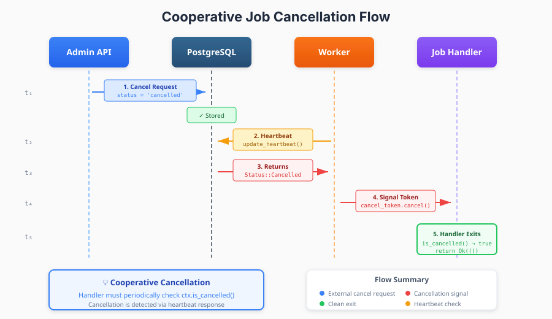
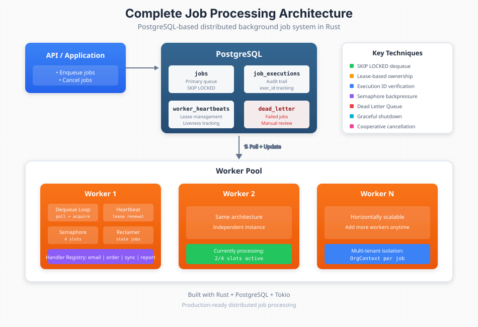

## Part 5: Production Patterns — Cancellation, Handlers & Multi-Tenancy

*This is Part 5 of a 5-part series on building production-grade distributed job processing systems in Rust using PostgreSQL.*

### Job Cancellation: External Control

Sometimes jobs need to be stopped mid-flight. A customer cancels their order. An admin aborts a runaway process. The system detects a duplicate.

Our cancellation system uses **cooperative cancellation**—the job handler periodically checks for cancellation signals and exits gracefully.

#### The Cancellation Flow

1. External system sets job status to `cancelled`
2. Worker's heartbeat task receives this status
3. Heartbeat signals the handler via `CancellationToken`
4. Handler checks `is_cancelled()` and exits cleanly

```rust
impl JobContext {
    /// Check if job has been cancelled
    pub fn is_cancelled(&self) -> bool {
        self.cancellation_token
            .as_ref()
            .map(|t| t.is_cancelled())
            .unwrap_or(false)
    }

    /// Async wait for cancellation signal
    pub async fn cancelled(&self) {
        if let Some(token) = &self.cancellation_token {
            token.cancelled().await
        }
    }
}
```



#### Writing Cancellation-Aware Handlers

The key is checking for cancellation at safe points—typically between processing chunks:

```rust
async fn handle(&self, job: &Job, ctx: &JobContext) -> Result<()> {
    let items: Vec<Item> = serde_json::from_value(job.payload.clone())?;

    for (i, item) in items.iter().enumerate() {
        // Check for cancellation before each item
        if ctx.is_cancelled() {
            info!("Job {} cancelled at item {}/{}", job.id, i, items.len());
            return Ok(());  // Clean exit
        }

        self.process_item(item).await?;
    }

    Ok(())
}
```

For long-running operations, use `tokio::select!` to race between work and cancellation:

```rust
tokio::select! {
    result = self.long_running_operation() => {
        result?
    }
    _ = ctx.cancelled() => {
        info!("Cancelled during long operation");
        return Ok(());
    }
}
```

### Handler Registry Pattern

Job handlers are registered in a type-safe registry that decouples job types from processing logic.

#### The Handler Trait

```rust
#[async_trait]
pub trait JobHandler: Send + Sync {
    /// Process the job
    async fn handle(&self, job: &Job, context: &JobContext) -> Result<()>;

    /// Return the job type this handler processes
    fn job_type(&self) -> &str;
}
```

Each handler is self-describing—it declares which job type it handles:

```rust
pub struct SendEmailHandler {
    email_client: Arc<dyn EmailClient>,
}

#[async_trait]
impl JobHandler for SendEmailHandler {
    fn job_type(&self) -> &str {
        "send_email"
    }

    async fn handle(&self, job: &Job, ctx: &JobContext) -> Result<()> {
        let payload: SendEmailPayload = serde_json::from_value(job.payload.clone())?;
        self.email_client.send(&payload).await?;
        Ok(())
    }
}
```

#### The Registry

```rust
pub struct JobRegistry {
    handlers: HashMap<String, Box<dyn JobHandler>>,
}

impl JobRegistry {
    pub fn new() -> Self {
        Self { handlers: HashMap::new() }
    }

    pub fn register(&mut self, handler: Box<dyn JobHandler>) {
        let job_type = handler.job_type().to_string();
        self.handlers.insert(job_type, handler);
    }

    pub fn get(&self, job_type: &str) -> Option<&dyn JobHandler> {
        self.handlers.get(job_type).map(|h| h.as_ref())
    }
}
```

#### Worker Registration

At startup, workers register all handlers:

```rust
fn main() {
    let mut registry = JobRegistry::new();

    // Register handlers
    registry.register(Box::new(SendEmailHandler::new(email_client)));
    registry.register(Box::new(ProcessOrderHandler::new(order_service)));
    registry.register(Box::new(SyncInventoryHandler::new(inventory_client)));
    registry.register(Box::new(GenerateReportHandler::new(report_service)));

    let worker = Worker::new(config, repository, registry);
    worker.run().await;
}
```

This pattern enables:
- **Modularity**: Add new job types without modifying core worker code
- **Testability**: Mock handlers in tests
- **Type Safety**: Compile-time guarantees on handler signatures

### Multi-Tenant Isolation

In SaaS applications, job processing must respect tenant boundaries. A bug processing Tenant A's jobs should never leak data to Tenant B.

#### Every Job Has an Organization

```rust
pub struct Job {
    pub id: Uuid,
    pub org_id: Uuid,      // Tenant identifier
    pub job_type: String,
    pub payload: Value,
    // ...
}
```

#### Scoped Context Creation

When processing a job, the worker creates a tenant-scoped context:

```rust
async fn process_job_task(self: Arc<Self>, job: Job, permit: OwnedSemaphorePermit) {
    // Create organization-scoped context
    let org_context = self.inner.app_ctx.org_context(job.org_id);

    let job_ctx = JobContext::new(Arc::new(org_context))
        .with_cancellation_token(cancel_token.clone());

    // Handler receives scoped context
    if let Some(handler) = self.inner.registry.get(&job.job_type) {
        handler.handle(&job, &job_ctx).await?;
    }
}
```

#### What OrgContext Provides

The `OrgContext` typically includes:
- **Scoped repositories**: Database queries automatically filter by `org_id`
- **Tenant configuration**: Rate limits, feature flags, settings
- **Credentials**: Per-tenant API keys for external services
- **Audit logging**: All actions tagged with tenant ID

```rust
impl OrgContext {
    pub fn repository(&self) -> &OrgScopedRepository {
        // All queries automatically include WHERE org_id = ?
        &self.repository
    }

    pub fn config(&self) -> &TenantConfig {
        &self.config
    }
}
```

This ensures handlers can't accidentally access data outside their tenant—the scoping is enforced at the infrastructure level.

### Summary: The Complete Picture

Over this five-part series, we've built a complete distributed job processing system:



| Component | Purpose | Key Technique |
|-----------|---------|---------------|
| **Job Queue** | Store pending work | PostgreSQL tables |
| **Dequeuing** | Safe concurrent fetch | `SELECT FOR UPDATE SKIP LOCKED` |
| **Ownership** | Prevent zombies | Lease-based with heartbeats |
| **Safety** | No split-brain | Execution ID verification |
| **Recovery** | Auto-heal failures | Stale job reclamation |
| **Backpressure** | Resource management | Tokio Semaphore |
| **Failure Handling** | Quarantine bad jobs | Dead Letter Queue |
| **Lifecycle** | Clean shutdown | Graceful termination |
| **Control** | External management | Cooperative cancellation |
| **Extensibility** | Add job types | Handler Registry |
| **Security** | Tenant isolation | Scoped OrgContext |

### When to Use This Pattern

This PostgreSQL-based approach works well when:

- **You already use PostgreSQL** for your primary data store
- **Job volumes are moderate** (thousands to low millions per day)
- **Transactional consistency** matters (enqueue jobs with business data)
- **Operational simplicity** is valued over raw throughput
- **Multi-tenancy** requires strong isolation

Consider dedicated message brokers when:

- **Extreme throughput** is required (billions of messages)
- **Complex routing** (pub/sub, topics, exchanges) is needed
- **Cross-service communication** is the primary use case
- **Push-based delivery** is preferred over polling

### Final Thoughts

The techniques in this series aren't theoretical—they're battle-tested patterns extracted from production systems. PostgreSQL's robust primitives, combined with Rust's safety guarantees, create a foundation that's both powerful and maintainable.

The most elegant distributed systems aren't necessarily the ones with the most components—they're the ones that leverage existing infrastructure wisely. Sometimes, your database is more capable than you realize.

---

### Series Navigation

1. [Part 1: Introduction & Architecture Overview](/posts/distributed-background-job-processing-in-rust-and-postgresql-part-1)
2. [Part 2: The Core — SELECT FOR UPDATE SKIP LOCKED](/posts/distributed-background-job-processing-in-rust-and-postgresql-part-2)
3. [Part 3: Reliability Through Leases & Heartbeats](/posts/distributed-background-job-processing-in-rust-and-postgresql-part-3)
4. [Part 4: Concurrency, Backpressure & Failure Handling](/posts/distributed-background-job-processing-in-rust-and-postgresql-part-4)
5. **Part 5: Production Patterns — Cancellation, Handlers & Multi-Tenancy** (You are here)
