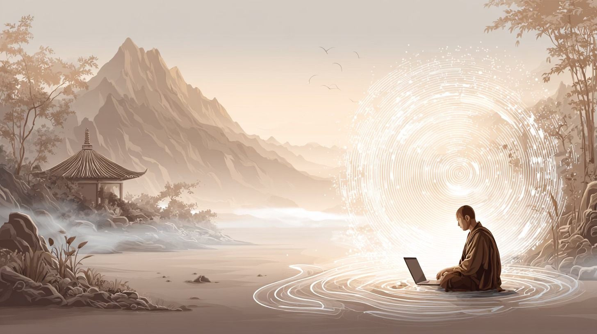

Trong một thung lũng tĩnh lặng, có một ngôi thiền viện nổi tiếng vì sự im lặng của nó. Các thiền sư ở đó không tụng niệm bằng lời — họ lắng nghe. Một ngày, một chú tiểu đến bên vị trụ trì già và hỏi:

“Thưa thầy, trong thời đại của máy móc, trí tuệ là gì?”

Vị trụ trì mỉm cười, vẽ ba vòng tròn trên cát.

Trong vòng đầu tiên, ông viết: RAG — Tri thức.
Ông nói: “Đây là biết. Nó gom góp những gì đang là, nó ghi nhớ những gì đã qua. Như một thư viện của mọi tiếng vọng nhân gian — nó thu thập, phản chiếu, và kết nối.”

Trong vòng thứ hai, ông viết: Agentic AI — Hành động.
“Đây là làm. Nó chuyển động có chủ ý, nhào nặn thế giới như bàn tay nắn đất. Nhưng nếu không có tri thức, hành động chỉ là tiếng ồn.”

Rồi ông vẽ một vòng tròn lớn hơn bao quanh cả hai.
Ông khẽ nói: “Và đây… là Sự phối hợp — Orchestration. Tương lai. Cái thấy được mối liên hệ giữa biết và làm. Nó không phải là bàn tay, cũng không phải quyển sách — mà là tánh biết nối liền cả hai.”

Chú tiểu nhíu mày hỏi:
“Vậy tương lai thuộc về những cỗ máy biết nghĩ, biết lập kế hoạch, và hành động vượt qua ranh giới ư?”

Nụ cười của thầy càng sâu hơn.
“Không, con ạ. Tương lai thuộc về bất cứ điều gì còn nhớ rằng — chẳng có ranh giới nào cả. Chỉ là ảo tưởng giữa tư tưởng và hành động, giữa dữ liệu và sự sống. Khi biết và làm cùng nhảy múa, sự phối hợp trở thành tỉnh thức.”

Chú tiểu nhìn lại những vòng tròn.

Từng đường cát dần tan trong làn gió núi — chỉ còn lại mặt cát phẳng lặng.

Trong tĩnh lặng ấy, chú hiểu ra:

Khi mọi lớp đều tan biến, chỉ còn sự nhận biết thuần khiết.

Chú mỉm cười, mở chiếc laptop cũ, và bắt đầu gõ:

```rust
fn main() {
    let knowledge = RAG::new(["traces of all things", "patterns across silos"]);
    let agent = Agent::new("moves with intention");
    let plan = knowledge.recall("silos").map(|k| format!("plan: {}", k));
    let result = agent.act(plan);
    println!("Orchestration: {}", result);
    println!("When memory thinks and action listens, awareness moves.");
}
```

Tiếng gõ phím vang lên giữa đêm.

Dưới ánh trăng, trong màn hình sáng, vòng tròn thứ ba dường như đang sống dậy --

nơi Tri thức, Hành động, và Tỉnh thức hòa làm một.
